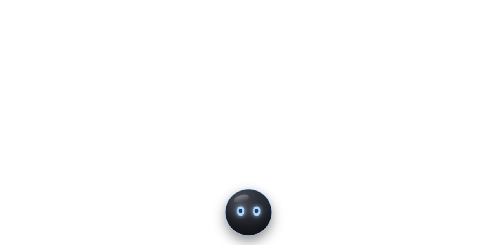
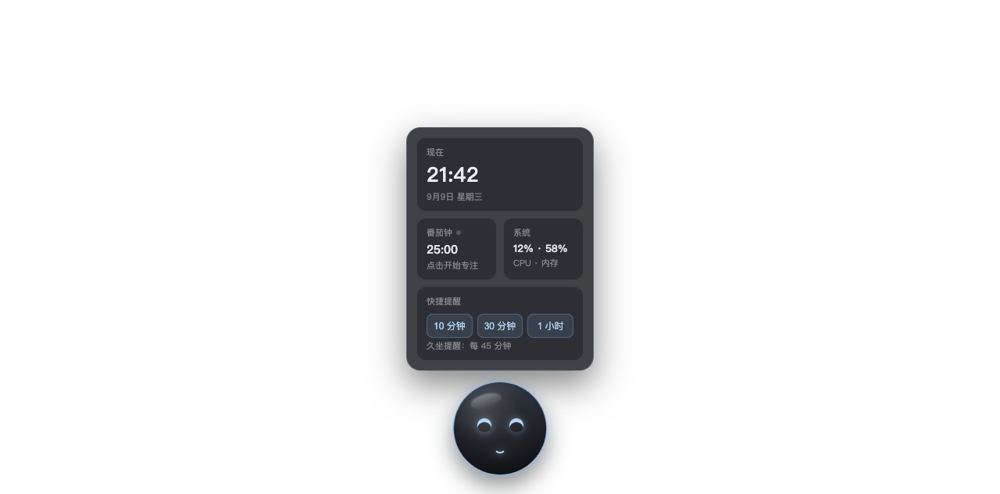

# Mio · macOS 桌面陪伴机器人

对标蔚来 NOMI 的桌面端小机器人：一颗有生命感的深色玻璃球，常驻屏幕角落。




## 快速开始

### 方式一：安装为 macOS 应用（推荐）

打开 `dist/Mio-1.0.0-arm64.dmg`，把 Mio 拖进 Applications 即可。
（本机已预装至 `/Applications/Mio.app`，启动台搜索 "Mio" 即可打开）

### 方式二：源码运行

```bash
cd mio
npm install        # 如 Electron 二进制下载失败，见下方"国内镜像"
npm start
```

国内镜像安装 Electron：

```bash
ELECTRON_MIRROR="https://npmmirror.com/mirrors/electron/" npm install
```

不想装 Electron 也可以直接用浏览器预览 `renderer/index.html`（自动降级为模拟数据）。

### 重新打包

Mio 无第三方运行时依赖，打包为纯系统工具手工流程（见下方"手工打包"），
不依赖 electron-builder。

## 功能

| 功能 | 交互 |
|------|------|
| 视线跟随 | 眼睛实时盯着全屏光标 |
| 眨眼 / 呼吸 / 打瞌睡 | 自动，5 分钟无交互进入困倦 |
| 快捷面板 | 单击球体：时间 / 番茄钟 / 系统状态 / 快捷提醒 |
| 开心 | 单击球体（弯月眼 + 弹跳） |
| 惊讶 | 双击 |
| 好奇 | 鼠标悬停 |
| 拖拽移动 | 按住球体拖动，位置自动记忆 |
| 右键菜单 | 置顶开关 / 透明度 / 退出 |
| 召唤 / 隐藏 | 全局快捷键 `⌥ + Space` |
| 番茄钟 | 25 分钟专注 + 5 分钟休息，到时系统通知 |
| 久坐提醒 | 每 45 分钟一次系统通知 |

## 架构

```
mio/
├── main.js            # 主进程：窗口、全局快捷键、右键菜单、IPC、系统状态、通知
├── preload.js         # contextBridge 安全桥
├── renderer/
│   ├── index.html     # 球体 + 面板结构
│   ├── style.css      # 液态玻璃样式 + 六表情状态机 + 生命感动画
│   └── app.js         # 状态机 / 眨眼 / 视线跟随 / 番茄钟 / 提醒
└── docs/              # 需求分析 / UI 设计 / 测试报告
```

关键实现：

- **点击穿透**：窗口默认 `setIgnoreMouseEvents(true, {forward:true})`，
  渲染进程监听 mousemove，悬停到可交互元素时通过 IPC 动态关闭穿透
- **全局视线跟随**：主进程 80ms 轮询 `screen.getCursorScreenPoint()` 广播给渲染层
- **表情状态机**：`mio--{idle|happy|curious|sleepy|surprised|thinking}` class 切换，
  临时表情自动回落 idle；番茄钟运行叠加 `mio--working` 绿色轮廓
- **纯 transform/opacity 动画**，GPU 合成，待机零布局开销

## 手工打包（无 electron-builder）

```bash
# 1. 图标：build/icon.html 离屏渲染 1024px → sips 多尺寸 → iconutil 出 icns
# 2. 组装：⚠️ 必须用 ditto 复制 Electron.app（cp -R 会损坏 bundle 导致无法启动）
#    ditto Electron.app Mio.app，应用代码放进 Contents/Resources/app/
# 3. PlistBuddy 写入 CFBundleName/Identifier/IconFile + LSUIElement
# 4. ⚠️ 改完 bundle 必须重签：codesign --force --sign - Mio.app
#    （原 adhoc 签名在修改后失效，Gatekeeper 会拒绝双击启动）
# 5. DMG：hdiutil create -volname Mio -srcfolder <含app+Applications软链的目录> -ov -format UDZO
```

自动化自检：`MIO_AUTOTEST=1` 启动会走查核心交互并截图到 `docs/shots/`。
