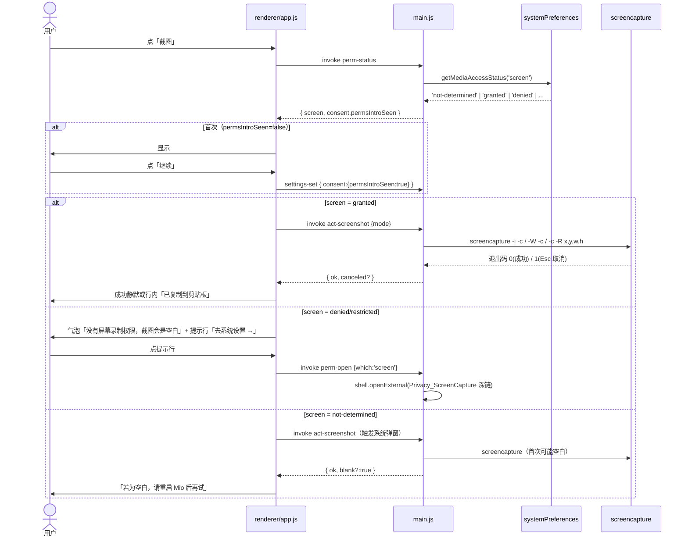
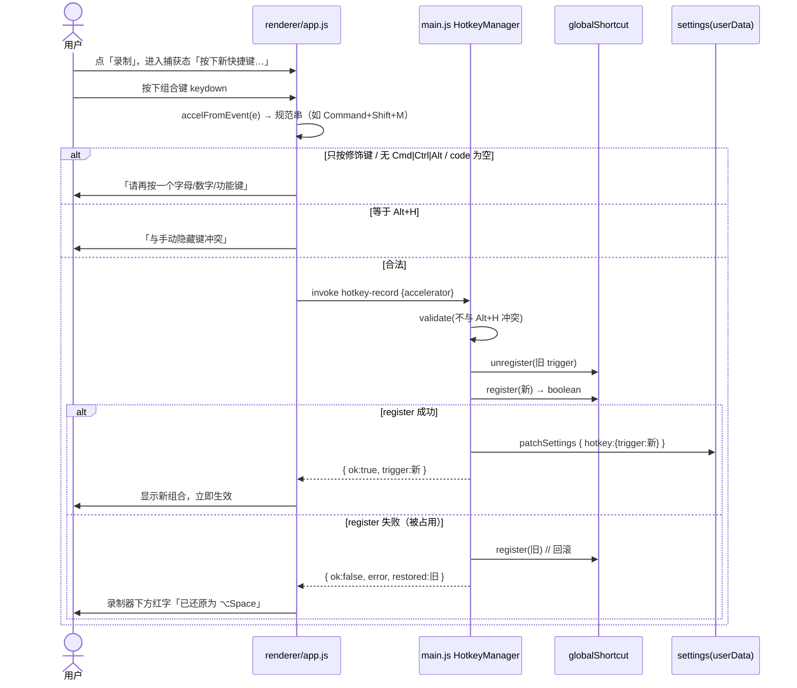
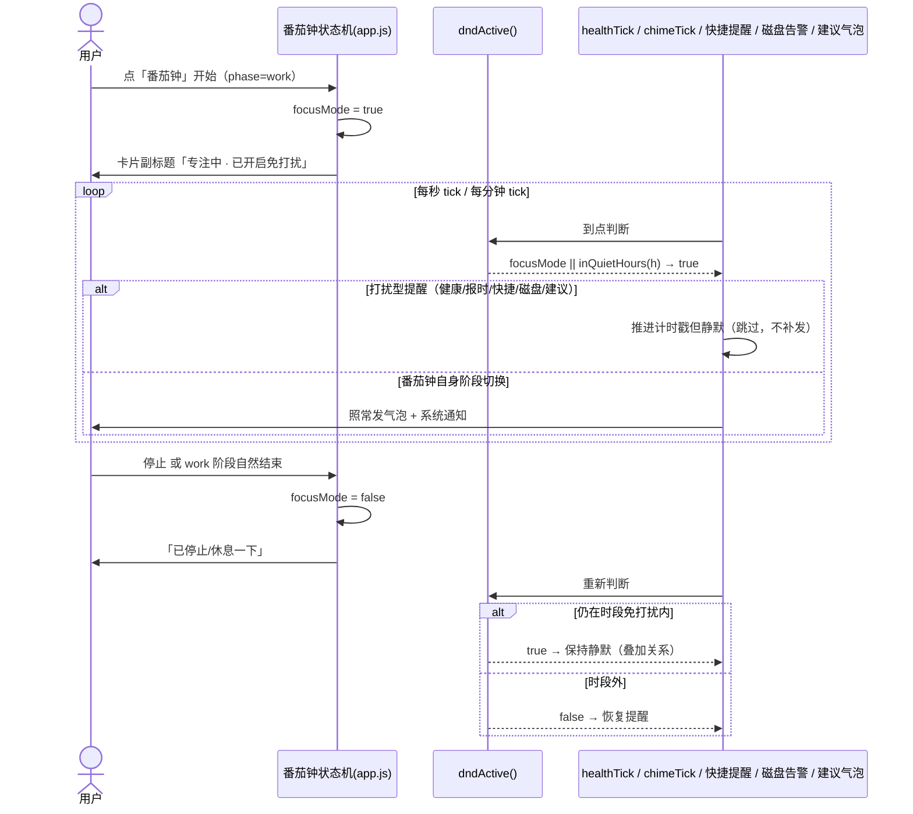

# 10 · 增量系统设计 v1.6「交互扩展：让 Mio 能替用户做事」

| 项 | 内容 |
|---|---|
| 版本 | v1.6.0（基线 v1.5.0 / commit `d4345d5`） |
| 日期 | 2026-09-11 |
| 上游 | `docs/09-增量PRD-v1.6.md`（唯一需求来源）· `docs/07-设置中心-功能梳理.md` §四 E/D/C · §五 · §六 · `docs/05-研发路线图.md` §二/§4/§8 |
| 范围 | 批次 2 全部 5 项：B2-1 剪贴板历史 · B2-2 快捷操作三件套 · B2-3 快捷键自定义 · B2-4 专注联动 · B2-5 设置 E/D/C 组填充 |
| 硬约束 | ① 零第三方运行时依赖 ② 删除必人工确认 + 只进废纸篓（**绝不 `rm`**）③ TCC 权限集中引入、一次讲清 |

---

## 一、实现方案总览

### 1.1 B2-1 剪贴板历史（只认文本 · 只在内存）

| 项 | 设计 |
|---|---|
| 为什么这么选 | 采集在**主进程内存**完成，渲染层只拿「预览串」，真文本永不出主进程。零落盘 = 天然满足隐私可验证要求（`userData` grep 无内容、重启归零）。 |
| 采集方式 | 主进程 `setInterval(800ms)` 轮询 Electron 内置 `clipboard.readText()`（`electron` 模块，非 npm 包）。与上一条文本逐字符比较去重，**不引入 crypto/hash 包**。 |
| 数据结构 | `{ id, text, pinned, t }` 数组，**最新在 index 0**。 |
| 入库规则 | ① 空串 / 纯空白（`text.trim()===''`）→ 丢弃；② `enabled=false` 或 `paused=true` → 不采集；③ `filterPassword=true` 且命中启发式 → 丢弃并回一条轻提示；④ 若列表已存在**完全相同**文本 → 不新增，改为置顶（`pinned` 条原地不动）；⑤ 否则 `unshift` 新条。 |
| 上限裁剪 | `limit ∈ {5,10,20}`（默认 10）为**总数上限**；裁剪时从尾部找**最旧的未钉条**剔除；若全部已钉（≤3 条）则不再剔除。改小 limit → 立即裁剪（钉住条保留）。 |
| 钉住 | `pinned<=3`（Q2）；占满时禁用「钉」并提示「先取消一条」。钉住条不参与顶替。 |
| 密码过滤 | 启发式：`len∈[8,64] && 无空白 && /[a-z]/ && /[A-Z]/ && /\d/`。**默认关闭**（Q3/路线图 §9.1）。命中时**只跳过采集、不动系统剪贴板**，并节流（≥30s 一条）回轻提示。 |
| 暂停 | 运行时布尔 `paused`，**不落盘**（Q5）。暂停时把「当前剪贴板文本」记为基线，恢复后不把暂停期间的旧值补进列表。暂停不清空历史。 |
| 取回 | `clip-copy(id)`：主进程 `clipboard.writeText(text)` + 置顶 + 更新基线（防轮询重复入库）。渲染层不接触全文。 |
| 删除 | 单条 / 全部删除均在内存完成，**不写废纸篓、不改系统剪贴板当前值**。 |
| 踩坑点 | ① 轮询撞上「用户点取回」→ 用 `writeText` 后立即更新 `lastText` 基线；② `enabled` 关闭要**同时停轮询 + 清空列表**；③ 系统「敏感/隐藏类型剪贴板」不做（P2，Q3）。 |

### 1.2 B2-2 快捷操作三件套（本批次唯一引入系统权限的功能）

| 动作 | 命令 / API | 权限 | 失败/降级 |
|---|---|---|---|
| 锁屏 | 真锁：`osascript -e 'tell application "System Events" to keystroke "q" using {command down, control down}'`；降级：`pmset displaysleepnow` | 辅助功能 | 未被信任 → **自动降级熄屏**，明确告知「已熄屏，但**没有锁定**」+ 深链。无破坏性，**不做二次确认**。 |
| 截图→剪贴板 | 选区 `screencapture -i -c`；窗口 `screencapture -W -c`；全屏 `screencapture -c -R <x,y,w,h>`（**光标所在屏的 bounds**，见 Q4） | 屏幕录制 | **先探测后调用**：`denied/restricted` → 根本不调 `screencapture`（避免黑图），返回 `need:'screen'` + 深链。Esc 取消（`-i` 退出码 1）→ 静默，不写历史、不报错。 |
| 清空废纸篓 | **`osascript -e 'tell application "Finder" to empty the trash'`**（macOS 原生清空，**绝不 `rm`**） | 自动化（控制 Finder） | 三重护栏（Q6）：① 强制二次确认且按钮/弹层先亮释放量；② 仅 `~/.Trash`；③ 原生清空。自动化被拒 → 只提示去系统设置开启，**不回退到 `rm`**。 |

**⚠️ 路线图 §4.1 的技术修正（必读）**：原文「`~/.Trash` 白名单内 → 复用 `clean-execute` 逐项 `shell.trashItem`」**原理上不成立** —— 对已在废纸篓中的文件再 `trashItem` 等于原地不动，废纸篓永不变空。故本版改走 Finder 原生「清空废纸篓」，代价是首次触发会申请**「自动化 / 控制 Finder」** TCC 权限（AppleEvents 类别）。因此 §6.3 统一说明弹层由两项权限**扩为三项**（屏幕录制 / 辅助功能 / 自动化-控制 Finder）。

- 释放量：**复用现有 `dirSize(path.join(HOME,'.Trash'))`**（`main.js:650`），无需新代码；缓存 30s。
- 空废纸篓：`bytes===0` → 按钮置灰 + 「已是空的」。
- 部分失败：逐项统计「已清 N 项 / M 项失败」（Finder 对占用项会静默保留，本版按执行返回报数即可）。

### 1.3 B2-3 召唤快捷键自定义（录制器）

| 项 | 设计 |
|---|---|
| 默认 | `Alt+Space`（存储于 `settings.hotkey.trigger`）。**⌥H 为固定兜底**，恒注册、不可覆盖（KEY-2）。 |
| 录制 | 渲染层捕获 `keydown`，用 **code → Electron accelerator 映射函数**（§三·3）产出规范串，交主进程注册。仅按修饰键不确认，提示「请再按一个字母/数字/功能键」。 |
| 原子应用（回滚） | `unregister(旧) → register(新) → 失败则 register(旧)`；成功后落盘 `settings.hotkey.trigger`。失败提示「已还原为 ⌥Space」。 |
| 冲突 | 录成 `Alt+H` → 直接拒绝「与手动隐藏键冲突」。 |
| 启动注册 | `whenReady` 读 settings 注册召唤键；`register` 失败（被占用）→ 回退尝试 `Alt+Space`；仍失败仅保留 ⌥H 并回传 `hotkeyRegistered=false` 供 UI 提示。 |

### 1.4 B2-4 专注模式联动（番茄钟 ↔ 免打扰）

| 项 | 设计 |
|---|---|
| 状态 | 渲染层 `focusMode`（内存，**不落盘**，重启归零）。`focusMode = pomoRunning && pomoPhase==='work'`。 |
| 判据 | `dndActive() = focusMode || inQuietHours(new Date().getHours())` —— 与时段免打扰**叠加**（FOCUS-3，任一命中即静默）。 |
| 抑制面 | 健康提醒、整点报时、快捷提醒、磁盘告警、智能建议气泡；**气泡与系统通知双通道都静**。 |
| 不抑制 | 番茄钟**自身阶段切换通知**（休息开始/结束）仍发（FOCUS-1）。 |
| 跳过不补发 | 抑制期到点的健康提醒：**推进其计时戳但不发**，避免专注结束时连响（Q7）。整点报时按幂等键自然跳过。 |
| 还原 | 停止 / 工作阶段结束 → `focusMode=false`；若仍在时段免打扰内则继续静默（时段判据独立）。手动改过的其它设置不受影响。 |
| 文案 | 番茄钟卡片副标题：「专注中 · 已开启免打扰」。 |

### 1.5 B2-5 设置中心填充（E / D1 / C9 / C10）

| 组 | 项 | 控件 | 落点键 |
|---|---|---|---|
| E | E1 剪贴板历史开关 | 开关 | `clipboard.enabled` |
| E | E2 保留条数 | 三选一 5/10/20 | `clipboard.limit` |
| E | E3 疑似密码过滤（默认关） | 开关 | `clipboard.filterPassword` |
| E | E4 截图默认模式 | 两段二选一：选区/全屏/窗口 + 存剪贴板/存文件 | `capture.mode` / `capture.dest` |
| E | E5 清空前确认 | **只读说明项（不可关）** | 无（硬约束 2） |
| D1 | 召唤快捷键 | 录制器 + 恢复默认 | `hotkey.trigger` |
| C9 | 通知方式 | 三选一 气泡/系统/两者（**默认 both**，Q8） | `notify.style` |
| C10 | 番茄钟默认时长 | 三选一 25/45/60 | `pomodoro.work` |

新增 `#introOverlay`（**面板内**统一说明弹层，非系统窗，三权限一次讲清），「已弹过」标志存 `settings.consent.permsIntroSeen`（可跨重启，重启不再吓第二次）。所有失败态走「气泡一句话 + 面板内可点提示行（去系统设置））」双通道；二次确认复用现有 `#confirmOverlay`（`app.js:525 showConfirm`）。

---

## 二、技术校验

> 结论均以**本机 `node_modules/electron/electron.d.ts`（Electron 33.4.11）**逐条核对。

### 2.1 三前提结论

| # | 前提 | 结论 | 证据（electron.d.ts） |
|---|---|---|---|
| 1 | 屏幕录制探测 `getMediaAccessStatus('screen')` | ✅ 可用，返回 `'not-determined'\|'granted'\|'denied'\|'restricted'\|'unknown'`，零成本、不弹窗 | L12467 |
| 1b | **`askForMediaAccess` 不支持 `'screen'`** | ⚠️ 仅支持 `'microphone'\|'camera'`（L12405）。**屏幕录制 TCC 弹窗只能由"真正发起一次捕获"触发**，无法靠 API 直接唤起 → 设计为「先探测，`not-determined` 时首次调用 `screencapture` 以触发系统弹窗」。 |
| 1c | 屏幕录制授权**需重启 App 生效**（macOS 机制） | ⚠️ 授权后当前进程仍拿到黑图 → 文案提示「授权后请重启 Mio」，并在下次触发时**重新探测**。 |
| 2 | 辅助功能探测 `isTrustedAccessibilityClient(false)` | ✅ 可用，`false` 不弹窗；**首次交互要弹系统窗时用 `(true)`** | L12515 |
| 3 | `globalShortcut.register()` 回滚 | ✅ `register(acc, cb): boolean`（false=被占用）· `unregister(acc)` · `isRegistered(acc)` 均可用 | L7860 / L7882 / L7841 |

**「先探测、再截图」顺序（ACT-2 核心）**：

```
screenStatus = systemPreferences.getMediaAccessStatus('screen')
  ├─ 'granted'                       → 调 screencapture
  ├─ 'denied' | 'restricted'         → 不调用，返回 need:'screen' + 深链（避免黑图）
  └─ 'not-determined'                → 用户点过「继续」后调用 screencapture（触发系统弹窗）；
                                        结果可能为空白 → 提示「若为空白请重启 Mio 后再试」
```

### 2.2 已核实的系统命令 / API 清单

| 用途 | 命令 / API | 来源 | 权限 |
|---|---|---|---|
| 读剪贴板文本 | `clipboard.readText()` / `writeText()` | Electron | 无 |
| 屏幕录制态 | `systemPreferences.getMediaAccessStatus('screen')` | Electron | 无（探测） |
| 辅助功能态 | `systemPreferences.isTrustedAccessibilityClient(false/true)` | Electron | 无（探测） |
| 深链跳转 | `shell.openExternal('x-apple.systempreferences:…')` | Electron | 无 |
| 截图 | `screencapture -i -c` / `-W -c` / `-c -R x,y,w,h` | macOS 自带 | 屏幕录制 |
| 锁屏 | `osascript -e 'tell application "System Events" to keystroke "q" using {command down, control down}'` | macOS | 辅助功能 |
| 熄屏降级 | `pmset displaysleepnow` | macOS 自带 | 无 |
| 清空废纸篓 | `osascript -e 'tell application "Finder" to empty the trash'` | macOS | 自动化(Finder) |
| 废纸篓体积 | 复用 `dirSize(path.join(HOME,'.Trash'))` | 现有 `main.js:650` | 无 |
| 全局快捷键 | `globalShortcut.register/unregister/isRegistered` | Electron | 无 |

### 2.3 三条技术前提的落地结论（写进实现）

1. **屏幕录制**：`getMediaAccessStatus('screen')` 先探测 → 被拒绝不调 `screencapture`；`not-determined` 时才调用以触发系统弹窗；授权后提示重启。
2. **辅助功能**：探测传 `false`（不弹窗）；用户点「继续」后调 `isTrustedAccessibilityClient(true)` 触发系统弹窗。锁屏失败降级熄屏。
3. **快捷键回滚**：`unregister(旧)→register(新)→失败 register(旧)` 原子流程；⌥H 恒定保留；落盘 `settings.hotkey.trigger`。

### 2.4 深链清单

```
屏幕录制   x-apple.systempreferences:com.apple.preference.security?Privacy_ScreenCapture
辅助功能   x-apple.systempreferences:com.apple.preference.security?Privacy_Accessibility
自动化     x-apple.systempreferences:com.apple.preference.security?Privacy_Automation
```

### 2.5 Finder 自动化（自动化权限）探测手段

无 `systemPreferences` API 可查自动化权限，采用**无副作用探测脚本 + 错误码判定**：

```
探测：osascript -e 'tell application "Finder" to get name of startup disk'   (timeout 4s)
  ├─ exit 0                       → automation = 'granted'
  ├─ stderr 含 -1743 / "Not authorized to send Apple events"  → automation = 'denied'
  └─ 其它（如 -600 Finder 未运行）→ automation = 'unknown'（放行到真实操作，由真实操作再判）
真实执行仍兜底：捕获 stderr 里的 -1743 → 判定被拒 → 提示去系统设置，**绝不回退 rm**。
```

---

## 三、文件清单

> 全部**修改现有文件**，**不新增源码文件**（延续 v1.5 单体结构，模块拆分属批次 4 债务 #17）。

| # | 路径 | 动作 | 做什么 |
|---|---|:---:|---|
| 1 | `package.json` | 修改 | `version` 1.5.0 → **1.6.0**（打包 plist 版本单一来源） |
| 2 | `main.js` | 修改 | `settings _v:3`；剪贴板采集器 + `clip-*`；快捷操作 `act-*`/`trash-*`；权限服务 `perm-*` + 深链；快捷键注册/回滚 `hotkey-*`；`whenReady` 注册区；`will-quit` 清理；`MIO_AUTOTEST` 断言 |
| 3 | `preload.js` | 修改 | 新增 `clip-*` / `act-*` / `trash-*` / `perm-*` / `hotkey-*` 桥接 + `clip-changed`/`clip-notice` 事件订阅 |
| 4 | `renderer/index.html` | 修改 | 常用 tab 新增「剪贴板」「快捷操作」卡片；设置新增 `data-group="clipboard"` 与 `data-group="hotkey"` 两组；notify 组加 C9/C10；新增 `#introOverlay` |
| 5 | `renderer/app.js` | 修改 | 剪贴板卡片/详情渲染与交互；快捷操作三按钮 + 权限引导；快捷键录制器 + `accelFromEvent`；专注联动 `dndActive()` 门控；设置绑定/摘要/`SETTING_KEYS` |
| 6 | `renderer/style.css` | 修改 | `.clip-item` / `.qa-row` / `.keyrec` / `#introOverlay` 等新样式（沿用 17 个 CSS 变量，不新增硬编码色） |
| 7 | `docs/10-增量设计-v1.6.md` | 新增 | 本设计文档 |
| 8 | `docs/sequence-diagram.mermaid` / `docs/class-diagram.mermaid` | 新增 | 图源文件 |

---

## 四、数据结构与接口

### 4.1 `settings` `_v:3` 增量 schema（沿用 `_v:2` 的 deepMerge 策略，**老键名不动**）

```js
const SETTINGS_VERSION = 3;   // main.js:33  由 2 改为 3

// DEFAULT_SETTINGS 只增不改（骨架法：老配置叠上来自动长出新区）
{
  _v: 3,
  general:    { autoOpen: false },
  appearance: { /* 保持不变 */ },
  chime:      { /* 保持不变，向后兼容 */ },
  health:     { /* 保持不变 */ },
  notify:     { style: 'both' },          // ★ 由 'bubble' 改默认 'both'（Q8；v1.5 无 UI，此键从未被用户写入过）
  pomodoro:   { work: 25 },               // 🆕 C10，取值 25|45|60
  stealth:    { /* 保持不变 */ },

  clipboard:  { enabled: true, limit: 10, filterPassword: false },   // 🆕 E1/E2/E3
  capture:    { mode: 'region', dest: 'clipboard' },                 // 🆕 E4，mode: region|full|window，dest: clipboard|file
  hotkey:     { trigger: 'Alt+Space' },                              // 🆕 D1（Electron accelerator 规范串）
  consent:    { permsIntroSeen: false },                             // 🆕 统一说明弹层「只弹一次」标志
}
```

> 迁移：`deepMerge(DEFAULT_SETTINGS, saved)` —— v1.5 配置读入后自动补齐 `clipboard/capture/hotkey/pomodoro/consent`；`chime/health/stealth/appearance` 键名不动，老设置零改动。`notify.style` 因 v1.5 无入口、从无用户值，改默认为 `both` 安全。

### 4.2 剪贴板内存结构（**不落盘**）

```js
// 主进程内存，模块级单例，进程退出即消失
let clipItems = [];      // ClipItem[]，index 0 = 最新
let clipPaused = false;  // 不落盘（Q5）
let clipTimer = null;    // 800ms 轮询句柄
let clipLastText = '';   // 相邻去重 + 取回防重入基线
let clipPinnedCount = 0; // 派生，便于 UI

// ClipItem
{ id: 'c_<递增序号>', text: '<全文，绝不出主进程>', pinned: false, t: 1710000000000 }
// 出渲染层：{ id, preview: '<换行→空格、截断120字符>', pinned, t }
```

### 4.3 IPC 契约表

> 统一形状：`invoke` 返回 `{ ok: boolean, ...payload, error?: string }`；`send`（事件）仅主→渲染。

| channel | 方向 | 入参 | 返回 | 错误态 |
|---|---|---|---|---|
| `clip-list` | invoke | — | `{ ok, items:[{id,preview,pinned,t}], paused, enabled, limit, pinnedCount }` | — |
| `clip-copy` | invoke | `{id}` | `{ ok, preview }` | `{ok:false,error:'条目已不存在'}` |
| `clip-pin` | invoke | `{id}` | `{ ok, pinnedCount }` | 超 3 条 → `{ok:false,error:'最多钉 3 条，先取消一条'}` |
| `clip-unpin` | invoke | `{id}` | `{ ok, pinnedCount }` | — |
| `clip-delete` | invoke | `{id}` | `{ ok }` | — |
| `clip-clear` | invoke | — | `{ ok }` | — |
| `clip-pause` | invoke | `{paused:boolean}` | `{ ok, paused }` | — |
| `clip-changed` | main→render (send) | — | `{ count, paused }` | — |
| `clip-notice` | main→render (send) | — | `{ kind:'filtered' }` | — |
| `act-lock` | invoke | — | `{ ok, locked:boolean, degraded:boolean, need:'accessibility'\|null }` | 降级成功仍 `ok:true, locked:false` |
| `act-screenshot` | invoke | `{mode?}` | `{ ok, canceled?:true, need:'screen'\|null, blank?:true }` | 被拒 `ok:false,need:'screen'`；取消 `ok:true,canceled:true` |
| `trash-size` | invoke | — | `{ ok, bytes, count }` | — |
| `trash-empty` | invoke | — | `{ ok, removed, failed, need:'automation'\|null }` | 被拒 `ok:false,need:'automation'` |
| `perm-status` | invoke | — | `{ ok, screen:'granted'\|'denied'\|'not-determined'\|…, accessibility:boolean, automation:'granted'\|'denied'\|'unknown' }` | — |
| `perm-request` | invoke | `{which:'screen'\|'accessibility'}` | `{ ok, status }` | accessibility 触发 `isTrustedAccessibilityClient(true)` |
| `perm-open` | invoke | `{which:'screen'\|'accessibility'\|'automation'}` | `{ ok }` | `shell.openExternal(深链)` |
| `hotkey-record` | invoke | `{accelerator}` | `{ ok, trigger, restored? }` | 占用 → `{ok:false,error,restored:旧值}` |
| `hotkey-reset` | invoke | — | `{ ok, trigger:'Alt+Space' }` | — |
| `settings-get` | invoke | — | `… + hotkey, permissions:{screen,accessibility,automation}, hotkeyRegistered:boolean` | 扩展现有返回（`main.js:1102`） |

### 4.4 code → Electron accelerator 映射表（`accelFromEvent(e)`）

**修饰键**（取事件布尔位，至少一个 `Cmd/Ctrl/Alt` 才算合法组合）：

| KeyboardEvent | accelerator |
|---|---|
| `e.metaKey` | `Command` |
| `e.ctrlKey` | `Control` |
| `e.altKey` | `Alt` |
| `e.shiftKey` | `Shift` |

**主键**（用 `e.code`，物理键位、与输入法无关）：

| e.code | accelerator | e.code | accelerator |
|---|---|---|---|
| `KeyA`…`KeyZ` | `A`…`Z` | `Digit0`…`Digit9` | `0`…`9` |
| `F1`…`F24` | `F1`…`F24` | `Space` | `Space` |
| `Enter`/`NumpadEnter` | `Return` | `Escape` | `Escape` |
| `ArrowUp/Down/Left/Right` | `Up`/`Down`/`Left`/`Right` | `Backspace`/`Delete`/`Tab`/`Insert` | 同名 |
| `Home`/`End`/`PageUp`/`PageDown` | 同名 | `Minus/Equal/BracketLeft/BracketRight` | `-`/`=`/`[`/`]` |
| `Backslash/Semicolon/Quote` | `\`/`;`/`'` | `Comma/Period/Slash/Backquote` | `,`/`.`/`/`/`` ` `` |

**边界（必须按此拒绝 / 处理）**：

| 场景 | 处理 |
|---|---|
| 只按修饰键（`e.code` 为 `MetaLeft`/`ControlLeft`/`AltLeft`/`ShiftLeft`…） | **不确认**，提示「请再按一个字母/数字/功能键」 |
| 无任何 Cmd/Ctrl/Alt（如裸按 `A`） | 拒绝（避免劫持正常打字） |
| `e.code === ''`（部分 IME / 多媒体软键） | 拒绝：「这个键 Mio 认不出来，换个组合」 |
| 多媒体键（`MediaPlayPause` 等） | 本版**不支持**（捕获不稳定），拒绝 |
| 非 ASCII / 中文输入法 | 无影响：用 `e.code` 物理键位，仍得 `KeyA` 等 |
| 组合等于保留键 `Alt+H` | 拒绝：「与手动隐藏键冲突」 |
| 多个非修饰键同按 | 取第一个主键 |

**规范串生成**：修饰键按固定顺序 `Command → Control → Alt → Shift` 拼接 + `+主键`，例：`Command+Shift+M`、`Alt+Space`。

---

## 五、程序调用时序

### 5.1 截图带权限引导（ACT-2）



### 5.2 快捷键录制并生效（KEY-1/2）



### 5.3 番茄钟开始/结束的免打扰联动（FOCUS-1/2/3）



> 独立文件另存：`docs/sequence-diagram.mermaid`（含 5.1/5.2/5.3 三条链路）。

---

## 六、任务列表（按依赖拓扑排序）

> **共 5 个任务**（硬性上限）。T02/T03/T04 **仅依赖 T01、彼此可并行**；T05 为集成收敛。

### T01 · 项目基础设施与数据层（P0）

| 项 | 内容 |
|---|---|
| 涉及文件 | `package.json` · `main.js` · `preload.js` |
| 改哪里 | **package.json**：`version` → `1.6.0`。<br>**main.js**：`require` 补 `clipboard, systemPreferences`（L2）；`SETTINGS_VERSION` 2→3（L33）；`DEFAULT_SETTINGS` 增 `clipboard/capture/hotkey/pomodoro/consent`，`notify.style` 默认改 `'both'`（L35-51）；新增常量块（三条深链、`TRASH_DIR`、`RESERVED_HOTKEY='Alt+H'`、`DEFAULT_HOTKEY='Alt+Space'`）；新增 `perm-status / perm-open / perm-request` handler 骨架。<br>**preload.js**：新增全部 `clip-* / act-* / trash-* / perm-* / hotkey-*` 桥接与 `clip-changed`/`clip-notice` 订阅（签名先行，主进程侧可逐步补齐）。 |
| 依赖 | 无 |
| 验收 | `_v===3`；`getSettings()` 对新老配置都能长出新区；深链串正确；preload 暴露方法齐全 |

### T02 · B2-1 剪贴板历史全栈 + E1/E2/E3 设置（P0）

| 项 | 内容 |
|---|---|
| 涉及文件 | `main.js` · `preload.js` · `renderer/index.html` · `renderer/app.js` · `renderer/style.css` |
| 改哪里 | **main.js**：新增剪贴板模块（`clipItems/clipPaused/clipTimer/clipLastText`、`startClip()/stopClip()/addClip(text)/enforceLimit()/isPasswordLike()`）；`clip-*` handlers；`whenReady` 启停（依 `clipboard.enabled`）；`settings-set` 钩子（enabled 关闭→停+清空；limit 改小→立即裁剪）；`will-quit` `clearInterval(clipTimer)`。<br>**index.html**：常用 tab 增 `<div class="card expandable interactive-btn" id="clipCard" data-dv-title="剪贴板">`（摘要 +「暂停/继续」小按钮 + `.detail` 列表 + 顶栏「全部清除」）。<br>**app.js**：`SETTING_KEYS` 增 `'clipboard'`；`renderClipCard()`/剪贴板详情渲染（行 = 预览 + 钉 + ✕，行点击取回并闪「已复制」）；暂停 toggle 复用 `.switch`；`clip-changed`/`clip-notice` 订阅；密码过滤轻提示气泡。<br>**style.css**：`.clip-item` 等。 |
| 依赖 | T01 |
| 验收 | CLIP-1~6 全绿；`userData` grep 无内容；重启列表为 0 |

### T03 · B2-2 快捷操作三件套全栈 + 三权限引导（P0）

| 项 | 内容 |
|---|---|
| 涉及文件 | `main.js` · `preload.js` · `renderer/index.html` · `renderer/app.js` · `renderer/style.css` |
| 改哪里 | **main.js**：`PermissionService`（`screenStatus()/accessibilityTrusted(prompt)/probeFinder()/openSettings(which)`）；`QuickActions`（`lock()`→真锁/降级、`screenshot(mode)`→先探测后调用 + Esc 退出码判定 + 光标屏 `-R`、`trashSize()`→复用 `dirSize`、`emptyTrash()`→Finder 原生 + `-1743` 判定）；`act-*`/`trash-*` handlers。<br>**index.html**：常用 tab 增「快捷操作」卡（三按钮一行）+ 失败态提示行容器；新增 `#introOverlay`。<br>**app.js**：三按钮绑定；`trash-size` 拉取并刷新按钮文案「清空废纸篓 · X GB」/空则置灰；清空走 `showConfirm`（body 含释放量）；统一说明弹层「只弹一次」逻辑；失败态双通道（`say` + 行内提示行 + 深链）；Esc 取消静默。<br>**style.css**：`.qa-row` / `#introOverlay`。 |
| 依赖 | T01 |
| 验收 | ACT-1/2/3 全绿；被拒不调 `screencapture`；废纸篓仅原生清空；空桶置灰 |

### T04 · B2-3 快捷键自定义 + B2-4 专注联动 + C9/C10 设置（P0）

| 项 | 内容 |
|---|---|
| 涉及文件 | `main.js` · `preload.js` · `renderer/index.html` · `renderer/app.js` · `renderer/style.css` |
| 改哪里 | **main.js**：`HotkeyManager`（`validate/apply/reset/registerFromSettings` 原子回滚）；`whenReady` 由 settings 注册召唤键 + 恒注册 `Alt+H`；`hotkey-record`/`hotkey-reset` handlers；`settings-get` 回传 `hotkey/hotkeyRegistered`。<br>**index.html**：notify 组加 C9（seg 三选一）+ C10（seg 25/45/60）；新增 `<details data-group="hotkey">`（录制器 + 恢复默认 + ⌥H 只读说明）。<br>**app.js**：`accelFromEvent` 及映射表；录制器绑定/回滚提示；`dndActive()` 门控接入 `healthTick`（推进戳但不发）、`chimeTick`、快捷提醒 setTimeout、磁盘告警 interval、建议气泡；`pomodoro` 用 `settings.pomodoro.work` + 起停设/清 `focusMode` + 副标题；`SETTING_KEYS` 增 `'notify'/'pomodoro'/'hotkey'`；C9/C10 绑定。<br>**style.css**：`.keyrec`。 |
| 依赖 | T01 |
| 验收 | KEY-1/2、FOCUS-1/2/3、SET-6/7/8 全绿；失败回滚；专注期提醒全静默但番茄钟阶段通知仍发 |

### T05 · 设置页整合 + 端到端联调 + MIO_AUTOTEST 自检（P0）

| 项 | 内容 |
|---|---|
| 涉及文件 | `main.js` · `renderer/index.html` · `renderer/app.js` · `renderer/style.css` · `docs/*` |
| 改哪里 | **index.html**：E 组 `<details data-group="clipboard">`（E1/E2/E3/E4/E5）成组落位；组间顺序与 07 文档一致；`#setMore` 文案更新。<br>**app.js**：`renderSettings()` 各摘要（`sgBrief-clipboard`/`sgBrief-hotkey`/`sgBrief-notify`）；搜索过滤对新组生效；`SETTING_KEYS` 完整性核对。<br>**main.js**：`MIO_AUTOTEST` 追加 v1.6 断言（`_v===3`、clip 增/列/钉/删/清/裁剪、`perm-status`、hotkey 注册与回滚、`trash-size`、focus 门控、权限流程弹层只弹一次、`userData` 无剪贴板残留）。<br>**style.css**：设置新组样式收尾。 |
| 依赖 | T02 · T03 · T04 |
| 验收 | 全量验收清单逐条通过；`dependencies` 仍为空；`MIO_AUTOTEST=1` 全绿；打包 plist 版本 = 1.6.0 |

### 可并行性

```
T01 ──┬── T02 ──┐
      ├── T03 ──┼── T05
      └── T04 ──┘
```

- **T02 / T03 / T04 可并行**（仅依赖 T01；UI 落在不同卡片/不同设置组，冲突面小）。
- T05 依赖三者全部完成，串行收尾。

---

## 七、共享知识 / 跨文件约定

| # | 约定 |
|---|---|
| 1 | **错误返回统一形状**：主进程 handler 一律返回 `{ ok:boolean, ...payload, error?:string }`；失败时 `error` 为**中文可读文案**（绝不透传英文异常），渲染层直接显示，不拼接。 |
| 2 | **命名规范**：`settings` 键用 camelCase 分组对象；IPC channel 用 `域-动作`（`clip-list`、`act-lock`、`perm-open`）；剪贴板块前缀 `clip*`，快捷操作前缀 `act*`。 |
| 3 | **写入协议**：设置一律走「只发改动那一枝」的 `settings-set`（`app.js:254 patchSettings` / `buildPatch`），主进程 `deepMerge`，**不回传整棵树**。 |
| 4 | **权限态缓存策略**：`perm-status` 每次调用**实时探测**（零成本），渲染层**不缓存**、进入相关功能时重新拉；深链打开后不轮询自动刷新（PRD §6.4），用户重进功能再检测。 |
| 5 | **失败态双通道**：任何失败 = 球体气泡一句话 + 面板内一行可点提示（含「去系统设置」）；**不出现英文报错、不静默失败**。 |
| 6 | **二次确认**：复用 `#confirmOverlay`（`showConfirm`），**不新建弹层**；危险按钮文案先亮「释放量/项数」。 |
| 7 | **零落盘红线**：剪贴板文本只存在于主进程内存；渲染层仅拿 `preview`；`userData` 四文件不得出现剪贴板内容。 |
| 8 | **绝不 `rm`**：任何删除只走 `shell.trashItem` 或 macOS 原生清空废纸篓；本版唯一不可逆操作 = 清空废纸篓（走 Finder 原生）。 |
| 9 | **正则集中**：密码启发式、Finder 错误码 `-1743` 判定、深链串集中为常量，便于测试。 |
| 10 | **CSS 变量**：沿用 v1.5 的 17 个变量，新样式不写死色值；球体/气泡不参与主题化。 |
| 11 | **配置读取**：渲染层 `settings` 只保留 `SETTING_KEYS` 白名单内的键，meta（version/permissions…）走 `settingsMeta`。 |

**检查清单（提测前自查）**：`dependencies` 为空 · `_v===3` · 老配置升级不丢项 · `MIO_AUTOTEST=1` 全绿 · 重启后剪贴板为 0、暂停态清除、免打扰不残留 · 被拒权限不崩溃不静默 · 清空废纸篓路径仅 `~/.Trash`。

---

## 八、零依赖校验（逐条）

| 需求 | 会诱使人用的 npm 包 | 本设计用什么（零依赖） |
|---|---|---|
| 剪贴板读写 | `clipboardy` / `electron-clipboard-ex` | Electron 内置 `clipboard` 模块 |
| 内容去重/哈希 | `crypto-js` / `xxhash` | 直接字符串比较 / Node 内置 `crypto`（如需要） |
| 权限探测 | 原生模块 / `node-mac-permissions` | Electron `systemPreferences` |
| 深链跳转 | `open` / `opn` | Electron `shell.openExternal` |
| 截图 | `screenshot-desktop` / `sharp` | macOS `screencapture`（`execFile`） |
| 锁屏 | `node-key-sender` | `osascript` / `pmset` |
| 清空废纸篓 | `trash` / `empty-trash` | `osascript` 驱动 Finder 原生清空 |
| 目录体积 | `fast-folder-size` | 现有 `dirSize()`（`main.js:650`）+ `du` |
| 全局快捷键 | `electron-localshortcut` / `iohook` | Electron `globalShortcut` |
| 状态机/UI 辅助 | `xstate` / `lodash` | 手写 `focusMode` 布尔 + 现有状态机 |

**结论**：本批次全部能力均可由 Electron 内置模块 + macOS 自带命令 + Node 内置模块覆盖，`dependencies` 保持为空。**新增 npm 包 = 违反硬约束 1，一律拒绝。**

---

## 九、待明确事项（影响实现，附倾向）

| # | 待明确 | 我的倾向 |
|---|---|---|
| A | 剪贴板 `limit` 是否**含钉住条**？ | **含**（总数上限；钉住条只抵抗顶替、不额外占名额），以贴合 CLIP-1「返回 10 条」「第 11 条顶掉第 1 条」的断言。若改为「不占名额」则“返回 5 条”语义会漂移。 |
| B | 屏幕录制**授权后需重启 Mio** 才生效，如何处理？ | 授权后气泡提示「请重启 Mio 生效」，并在下次触发时**重新探测** status；不引入轮询自动刷新（符合 PRD §6.4）。 |
| C | Finder 自动化被拒**无 API 可查**，探测方式？ | 用无副作用 `osascript` 探测脚本 + 错误码 `-1743`/`Not authorized` 判定；探测不可靠时以**真实执行的 stderr** 兜底，**绝不回退 `rm`**。 |
| D | E4「截图存文件」存到哪？ | 默认保存到 `~/Desktop`，文件名含时间戳（如 `Mio-截图-20260911-1430.png`）；本版默认仍「存剪贴板」。 |
| E | 快捷键是否允许**无修饰键的 F1–F12** 单独使用？ | **不允许** —— 一律要求至少一个 `Cmd/Ctrl/Alt`，避免全局劫持系统/应用功能键。 |
