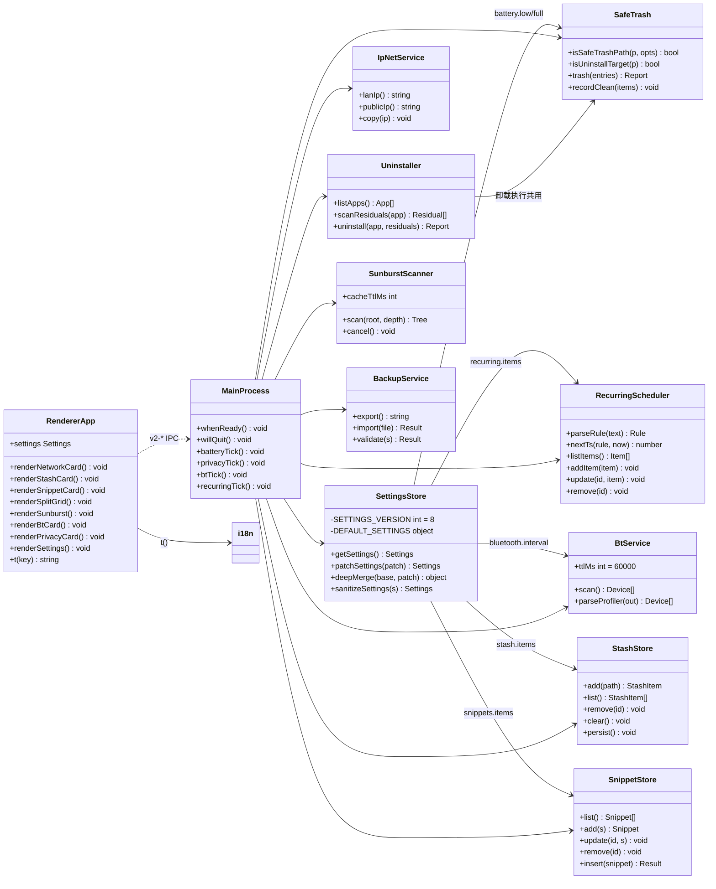
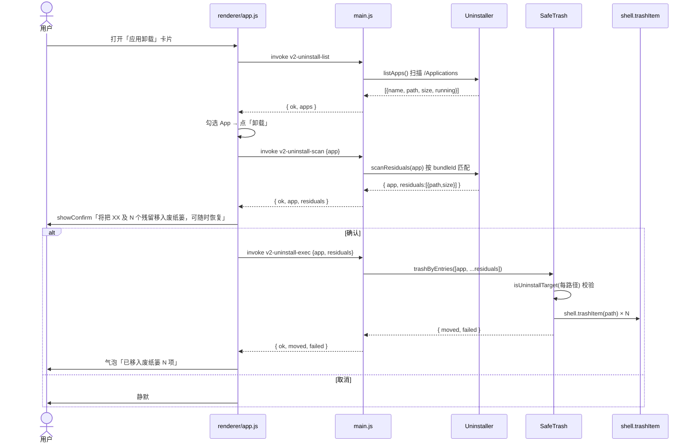
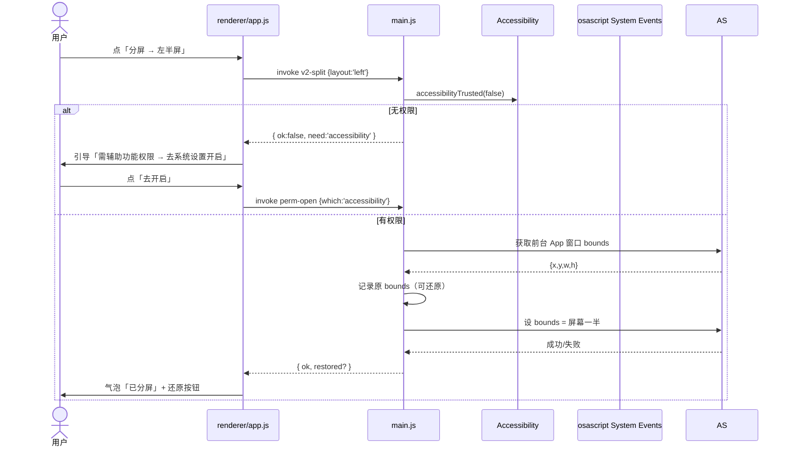
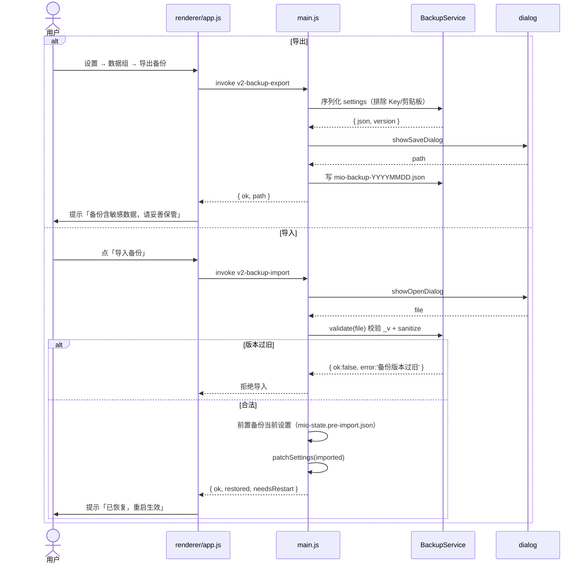

# 13 · 增量系统设计 v2.0「工具百宝箱」

| 项 | 内容 |
|---|---|
| 版本 | v2.0.0（基线 v1.9 / commit a787619） |
| 日期 | 2026-09-13 |
| 上游 | `docs/12-增量PRD-v2.0.md` + `docs/12-增量PRD-v2.0-新功能批次.md`（唯一需求来源）· `docs/05-研发路线图.md` §三 硬约束 / §9 决策 · `docs/07-设置中心-功能梳理.md` 十二组结构 · `docs/10-增量设计-v1.6.md` 风格基线 |
| 范围 | F1–F13 十三项新功能 + 3 项工程债（ENG-1 单元测试 / ENG-2 i18n / ENG-3 CI） |
| 硬约束 | ① 零第三方运行时依赖（`dependencies` 为空，只用系统命令 + Node 内置）② 删除类操作只进废纸篓 + 人手二次确认（**绝不 `rm`**）③ TCC 权限集中引入、一次讲清 |
| 已拍板决策 | **Q1** 剪贴板图片历史默认不落盘（内存策略），设置提供「落盘保留 N 张」可选（默认关）；**Q2** 分屏复用 I2 现有辅助功能权限通道，首用分屏提示引导、无权限降级为「仅对 Mio 自身窗口分屏 + 引导系统分屏」；**Q3** CI/自动更新从 `package.json` 的 `repository` 读 `wsq1998/Mino` |

---

## 一、实现方案总览（框架选型）

> 选型原则：**零第三方运行时依赖**。所有功能落到「系统命令 + Node 内置模块 + Electron 内置 API」三张牌上；能复用现有纯函数层（`main/core/*`）一律复用；删除类操作唯一入口是 `safeTrash()`（内部 `shell.trashItem`）。

### 1.1 功能 × 系统命令 / API 矩阵

| ID | 功能 | 系统命令 / Node API | 权限 | 复用底座 | 关键边界与降级 |
|---|---|---|---|---|---|
| F1 | 电量 / 满电充电提醒 | `/usr/bin/pmset -g batt`（60s 轮询） | 无 | `batteryInfo()`（main.js:354）+ 通知通道 | 无电池静默；`lastNotifiedLevel` 去重（内存 + `mio-state.json` 落盘，重启不重复轰炸）；免打扰时段联动；默认关 |
| F2 | 摄像头 / 麦克风占用警示 | `/usr/bin/lsof +c 0 -n -i` + 过滤 `/dev/video*` / `VDC` / `/dev/audio*`（10s 轮询） | 无 | 表情状态机 + 消息中心 | 文案用「可能仍在占用」；提供「忽略此 App」名单；前台 App 占用只静默展示；检测失败静默 |
| F3 | AirPods / 蓝牙设备电量 | `/usr/sbin/system_profiler SPBluetoothDataType` | 无 | `batteryHealth()` 的 system_profiler 先例（main.js:550） | **必须主进程异步 + 60s 缓存**（命令 2–5s）；输出格式多版本兼容；无设备 → 卡片隐藏 |
| F4 | 自定义循环提醒 | 纯函数 `recurring.js`（规则 → nextTs） | 无 | `alarm.js` 的 `onFire` 通知通道 + C8 免打扰 | 周期 ≥15min（防轰炸）；最多 20 条；重启不补跑；删除走普通确认（删配置非删文件） |
| F5 | 开机启动项管理 | 扫描 `~/Library/LaunchAgents` + `/Library/LaunchAgents`；用户级启停 = plist 移入/移出 | 复用自动化 | `app.setLoginItemSettings`（A1）+ 消息中心 | 只操作用户级；系统级只读；写操作前二次确认；每次操作写消息中心；可逆 |
| F6 | 公网 / 内网 IP | 内网 `/usr/sbin/ipconfig getifaddr en0`（回退 en1/utun）；公网 `fetch('https://api.ip.sb/geoip')` | 无 | `ipGeo()` 的 24h `geoCache`（main.js:1208） | 断网公网 IP 显示「—」；`clipboard.writeText` 复制；只展示不上传 |
| F7 | 应用卸载器 | 扫描 `/Applications` + `~/Applications`；`shell.trashItem` 移入废纸篓 | 无（删除走废纸篓） | `clean-paths` 六道闸 + `isBlacklistedPath` | **扩展白名单**允许 `.app` 本体 + 同名偏好 plist；先 `pgrep` 查运行；拒绝 `/System` 与 Apple 签名；两步确认（先 App 后残留） |
| F8 | 窗口分屏管理 | osascript `System Events` 设 window bounds | 辅助功能（复用 I2） | `accessibilityTrusted()` + D1 快捷键录制 | 记录原 bounds 可还原；无权限降级引导；多屏按窗口当前屏；失败面板内提示 |
| F9 | 剪贴板图片历史 | `clipboard.readImage()`（已有） | 无 | `addClipImage()`（main.js:1775）+ `thumb` dataURL | 默认不落盘（Q1）；>8MB 不采集；图片/文本共享总条数上限；暂停监听同样覆盖图片 |
| F10 | 文件暂存区 / 中转站 | 路径引用（`fs.stat` 只读元数据）+ `shell.showItemInFolder` | 无 | 无（新模块） | 不移动/不复制/不删除源文件；源文件被删显示「文件不存在」；清空走 `safeTrash`（仅删引用，不删文件）+ 二次确认；`mio-stash.json` 落盘 |
| F11 | 常用文本片段 | 本地 JSON + `clipboard.writeText`（粘贴降级） | 无 | 剪贴板卡片 + 设置骨架 | 明文落盘需披露；上限 20 条 / 2000 字符；与剪贴板历史不共享暂停 |
| F12 | 磁盘空间太阳图 | `du -sk`（`execP`）或 Node `fs` 递归 | 无 | 查重扫描漏斗（后台 + 进度 + 可中止） | 只扫 `~/` 下 7 个标准目录；30s 限时；10min 缓存；**原生 Canvas 2D** 不引图表库 |
| F13 | 设置备份导出 | `dialog.showSaveDialog` / `showOpenDialog` + `fs` | 无 | `sanitizeSettings()` + `_v` 版本化 | 导出**不含 Key 明文**；导入前校验版本 + 前置备份 + 二次确认 |

### 1.2 三个公共底座（硬约束落地）

#### ① `safeTrash()` —— 公共删除模块（F5/F7/F10/F13 共用）

删除类操作唯一入口，封装「路径验证 → 二次确认 → `shell.trashItem` → 清理历史」四段，杜绝各功能各自实现绕过硬约束 2。

```js
// main/core/safeTrash.js —— 纯函数 + 副作用分离，可单测
// trashWithConfirm(entries, { level, title, allowApps }) → { ok, moved, failed, report }
//   - 路径校验：isBlacklistedPath 升级为 isSafeTrashPath(p, { allowApps })（见下）
//   - 二次确认：由渲染层 showConfirm 完成（主进程不弹窗，只返回预备清单）
//   - 执行：shell.trashItem 逐项，失败项计入 failed 并保留（绝不 rm）
//   - 记录：recordClean(items) + logMessage（复用 main.js 现有 C5）
```

> **F7 白名单扩展**：`isBlacklistedPath` 目前只认 `$HOME/`（main/clean/targets.js:25）。v2.0 新增 `isUninstallTarget(p)` 只对 `safeTrash` 放行：`/Applications/<Name>.app`、`~/Applications/<Name>.app`、`~/Library/Preferences/<bundleId>.plist`、`~/Library/Application Support/<Name>/{...}`、`~/Library/Caches/<Name>`、`~/Library/Saved Application State/<bundleId>.savedState`；其余路径仍走黑名单。**系统级（/System、/usr、/Library 顶层）一律拒绝**。

#### ② i18n 语言包（ENG-2，先行）

v2.0 只做「文案集中化 + 中英两套」，不做全量切换框架（避免 13 项功能文案返工）。

```js
// renderer/i18n.js —— 键值对语言包 + t() 取词函数（纯函数，可单测）
// 结构：{ zh: { 'settings.notify.battery': '电量提醒', ... }, en: { ... } }
// 取词：t('settings.notify.battery') → 当前语言包；缺失键回退 zh
// 语言：settings.general.lang = 'zh' | 'en' | 'auto'（默认 auto 跟随系统）
// 主进程侧：main/i18n.js 只放「通知文案」键（通知由主进程发，需主进程取词）
```

#### ③ 设置 schema 迁移 `_v:7 → _v:8`

沿用 `deepMerge(DEFAULT_SETTINGS, saved)` 骨架法（main/core/settings.js），**只增不改、老键名不动**：

```js
const SETTINGS_VERSION = 8; // main/core/settings.js:5 由 7 改为 8

// DEFAULT_SETTINGS 新增（全部可安全 deepMerge）：
{
  _v: 8,
  general: { ..., lang: 'auto' },                    // ENG-2：zh | en | auto
  battery:  { enabled: false, low: 20, full: 80 },    // F1：默认关（避免打扰）
  privacy:  { monitor: true, ignoreApps: [] },         // F2：占用监控 + 忽略名单
  bluetooth:{ enabled: true, interval: 60 },           // F3：蓝牙电量
  recurring:{ items: [] },                              // F4：循环提醒列表
  network:  { enabled: true },                        // F6：网络卡片
  uninstall:{ confirmAlways: true },                  // F7：二次确认强制开启（不可关）
  split:    { enabled: true, hotkey: null },          // F8：分屏开关/快捷键
  clipboard: { ...existing, imageHistory: false, imagePersist: 0 }, // F9：默认不落盘
  stash:    { enabled: true, persist: true, items: [] }, // F10：中转站
  snippets: { items: [...] },                        // F11：文本片段（明文，披露）
  sunburst: { enabled: true },                       // F12：太阳图
}
```

> 迁移语义：老配置读入后自动长出新区（默认值兜底）；`sanitizeSettings` 增加对 `battery.low/full` 数值收口、`privacy.ignore` 数组收口、`recurring.repeat` 数组收口。**F13 导出/导入用同一套 sanitize 校验**。

---

## 二、文件清单

> 全部为**修改现有文件 + 新增纯函数层**，不新增任何第三方依赖文件。

### 2.1 新增文件

| # | 路径 | 做什么 |
|---|---|---|
| 1 | `main/core/safeTrash.js` | 公共删除模块（路径校验 + trashItem + 历史记录） |
| 2 | `main/core/recurring.js` | 循环提醒纯函数（规则解析 → nextTs，可单测） |
| 3 | `main/core/bluetooth.js` | `system_profiler SPBluetoothDataType` 解析（纯函数 + 主进程缓存） |
| 4 | `main/core/ipnet.js` | 内网 `ipconfig` / 公网 `api.ip.sb` 采集（纯函数 + 复用 geoCache） |
| 5 | `main/core/uninstall.js` | 应用列表扫描 + 残留扫描 + 卸载执行（safeTrash 封装） |
| 6 | `main/core/snippets.js` | 文本片段 CRUD + 明文落盘（`mio-snippets.json`） |
| 7 | `main/core/stash.js` | 中转站 CRUD + 落盘（`mio-stash.json`） |
| 8 | `main/core/sunburst.js` | 目录树扫描（`du` 后台 + 进度 + 可中止） |
| 9 | `main/i18n.js` | 主进程通知文案语言包（中英） |
| 10 | `renderer/i18n.js` | 渲染层语言包（中英 + t() 函数） |
| 11 | `renderer/sunburst.js` | 原生 Canvas 2D Sunburst 渲染（零图表库） |
| 12 | `test/core.test.js` | `node:test` 单元测试（settings/recurring/bluetooth/ipnet/safeTrash） |
| 13 | `.github/workflows/ci.yml` | CI：`npm ci` → 单测 → `MIO_AUTOTEST` → electron-builder 打包 |
| 14 | `docs/13-增量设计-v2.0.md` | 本设计文档 |
| 15 | `docs/class-diagram-v2.mermaid` | 类图源文件 |
| 16 | `docs/sequence-diagram-v2.mermaid` | 时序图源文件 |

### 2.2 修改文件

| # | 路径 | 做什么 |
|---|---|---|
| 1 | `package.json` | `version` → 2.0.0；`scripts.test` 加 `node --test test/`；`scripts.autotest` 加 `MIO_AUTOTEST=1 electron .`；`files` 增加 `main/core/**`、`main/tools/**`、`renderer/i18n.js`、`renderer/sunburst.js` |
| 2 | `main.js` | `_v:8` 设置迁移；注册 F1/F2/F3/F4/F6 轮询；`v2-*` IPC handlers；`MIO_AUTOTEST` 扩展断言；`whenReady` 启动区扩展 |
| 3 | `preload.js` | 新增 `v2-*` 桥接（battery/bt/privacy/ip/stash/snippet/split/uninstall/sunburst/backup） |
| 4 | `renderer/index.html` | 常用页新增卡片（网络 IP / 中转站 / 文本片段 / 分屏网格 / 应用卸载入口）；状态页新增「蓝牙设备」「隐私占用」「磁盘空间」卡片；设置页新增 `data-group` 子区 |
| 5 | `renderer/app.js` | 新卡片渲染 + 交互；`SETTING_KEYS` 加新区；`renderSettings` 加新绑定；`applyFeatureVisibility` 扩展；i18n 替换硬编码文案 |
| 6 | `renderer/style.css` | 新卡片 / 太阳图 / 中转站拖放区 / 卸载列表样式（沿用 CSS 变量） |
| 7 | `main/core/settings.js` | `SETTINGS_VERSION 7→8`；`DEFAULT_SETTINGS` 新增 12 个区；`sanitizeSettings` 收口 |
| 8 | `main/clean/targets.js` | `isBlacklistedPath` 扩展 `isUninstallTarget` |
| 9 | `main/system/constants.js` | `DEEP_LINKS` 增加分屏深链；`PROC_BLACKLIST` 补充摄像头进程名（如 `VDC` 相关） |
| 10 | `main/core/alarm.js` | 暴露 `onFire` 复用通道给 `recurring.js`（或 main.js 内桥接） |

> **不修改**：`main/core/state.js`（loadState/saveState 已够用）、`main/core/exec.js`（复用）、`main/core/pomo.js`、`main/llm/*`、`main/weather/*`。

---

## 三、数据结构与接口（类图）



> 完整类图见 `docs/class-diagram-v2.mermaid`。主进程内模块以「函数 + 命名区」形式挂 `main.js` 或拆入 `main/core/`（沿用现有纯函数层先例，可单测）。

---

## 四、程序调用时序（时序图）

### 4.1 F7 应用卸载（安全删除主链路）



### 4.2 F8 窗口分屏（权限集中引入）



### 4.3 F13 备份导出 / 导入（校验 + 前置备份）



> 完整时序见 `docs/sequence-diagram-v2.mermaid`。

---

## 五、IPC 契约表（v2-* 新增）

> 统一形状：`invoke` 返回 `{ ok, ...payload, error? }`；`send` 仅主→渲染。新通道一律 `v2-` 前缀，与既有 `clip-*`/`act-*`/`perm-*` 并列。

| channel | 方向 | 入参 | 返回 | 错误态 |
|---|---|---|---|---|
| `v2-battery-remind` | invoke | — | `{ ok, enabled, low, full, lastNotified }` | — |
| `v2-privacy-status` | invoke | — | `{ ok, active:[{device,app}], ignored:[...] }` | — |
| `v2-privacy-ignore` | invoke | `{app}` | `{ ok, ignored }` | — |
| `v2-bt-list` | invoke | — | `{ ok, devices:[{name,battery,connected}] }` | 解析失败 `{ok:false,error}` |
| `v2-recurring-list` | invoke | — | `{ ok, items }` | — |
| `v2-recurring-add` | invoke | `{name, rule, enabled}` | `{ ok, item }` | 周期<15min → `{ok:false,error}` |
| `v2-recurring-remove` | invoke | `{id}` | `{ ok }` | — |
| `v2-launch-items` | invoke | — | `{ ok, user:[...], system:[...] }` | — |
| `v2-launch-toggle` | invoke | `{id, enabled}` | `{ ok, action }` | 系统级 → `{ok:false,error:'只读'}` |
| `v2-net-info` | invoke | — | `{ ok, lan, wan, wanState }` | — |
| `v2-net-copy` | invoke | `{which}` | `{ ok }` | — |
| `v2-uninstall-list` | invoke | — | `{ ok, apps }` | — |
| `v2-uninstall-scan` | invoke | `{app}` | `{ ok, residuals }` | — |
| `v2-uninstall-exec` | invoke | `{app, residuals}` | `{ ok, moved, failed }` | — |
| `v2-split` | invoke | `{layout, undo?}` | `{ ok, need?, restored? }` | 无权限 `{ok:false,need:'accessibility'}` |
| `v2-stash-add` | invoke | `{path}` | `{ ok, item }` | 路径无效 → `{ok:false,error}` |
| `v2-stash-list` | invoke | — | `{ ok, items }` | — |
| `v2-stash-remove` | invoke | `{id}` | `{ ok }` | — |
| `v2-stash-clear` | invoke | — | `{ ok }` | — |
| `v2-snippet-list` | invoke | — | `{ ok, items }` | — |
| `v2-snippet-save` | invoke | `{name, text}` | `{ ok, item }` | 超 2000 字符 → 拒绝 |
| `v2-snippet-remove` | invoke | `{id}` | `{ ok }` | — |
| `v2-snippet-insert` | invoke | `{id}` | `{ ok, mode:'clipboard'\|'paste', need? }` | 无辅助权限降级 clipboard |
| `v2-sunburst-scan` | invoke | `{dir?, depth?}` | `{ ok, tree, progress? }` | — |
| `v2-sunburst-cancel` | invoke | — | `{ ok }` | — |
| `v2-backup-export` | invoke | — | `{ ok, path }` | 取消 → `{ok:true,canceled:true}` |
| `v2-backup-import` | invoke | — | `{ ok, restored, needsRestart }` | 版本不符 → `{ok:false,error}` |
| `v2-battery-event` | send | — | `{ kind:'low'\|'full'\|'charged' }` | — |
| `v2-privacy-event` | send | — | `{ device, app }` | — |
| `v2-recurring-fire` | send | — | `{ id, name }` | — |

---

## 六、任务分解（批次分组 + 任务列表）

> 交付分两层：**批次 A/B/C/D** 是给主理人/排期看的交付节奏（按功能域聚合、依赖清晰）；**任务 T01–T05** 是给工程师的落地清单（≤5 个、每组 ≥3 文件、首任务为基础设施）。两者一一映射，T 编号即实现顺序。

### 6.1 批次分组表（交付节奏）

| 批次 | 主题 | 功能/工程项 | 依赖 | 对应任务 |
|---|---|---|---|---|
| **A** | 底座先行（纯函数层 + 数据） | 设置 `_v8` 迁移 · `safeTrash` 公共删除 · i18n 语言包 · 循环提醒解析 · 蓝牙/网络/中转站/片段/太阳图扫描器等纯函数模块 · 单元测试骨架 | 无（可最先开工） | T01 + T02 |
| **B** | 常用页核心功能 | F1 电量提醒 · F4 循环提醒 · F6 网络 IP · F8 分屏 · F9 剪贴板图片历史 · F11 文本片段 · F10 中转站 | A 的 settings/safeTrash/i18n | T03 |
| **C** | 状态页 + 系统级能力 | F2 隐私占用 · F3 蓝牙电量 · F5 开机启动项 · F7 应用卸载 · F12 磁盘太阳图 | A 的 safeTrash/ipnet/bt 底座 | T04 |
| **D** | 设置中心 + 备份 + 工程债收口 | F13 设置备份导入导出 · 设置页 12 组子区 · ENG-1 单元测试全量 · ENG-3 CI | B/C 功能全部落地后 | T05 |

### 6.2 任务清单（T01–T05，按依赖排序）

| 任务 | 名称 | 源文件（新建/修改） | 依赖 | 优先级 |
|---|---|---|---|---|
| **T01** | 项目基础设施：版本/脚本/迁移骨架 | 修改 `package.json`、`main.js`（whenReady 启动区 + `_v:8` 迁移钩子）、`preload.js`（v2-* 桥接骨架）、`main/core/settings.js`（SETTINGS_VERSION 7→8 + 12 个新区默认值）、`main/core/alarm.js`（暴露 onFire）、`main/system/constants.js`（DEEP_LINKS + 摄像头进程名）；新建 `docs/13-增量设计-v2.0.md`、`docs/class-diagram-v2.mermaid`、`docs/sequence-diagram-v2.mermaid` | — | P0 |
| **T02** | 数据底座纯函数层 + i18n | 新建 `main/core/safeTrash.js`、`main/core/recurring.js`、`main/core/bluetooth.js`、`main/core/ipnet.js`、`main/core/uninstall.js`、`main/core/snippets.js`、`main/core/stash.js`、`main/core/sunburst.js`、`main/i18n.js`、`renderer/i18n.js`；修改 `main/clean/targets.js`（isUninstallTarget） | T01 | P0 |
| **T03** | 常用页核心功能（F1/F4/F6/F8/F9/F10/F11） | 修改 `main.js`（轮询：battery 60s / recurring 定时 / net 触发式 + `v2-*` IPC）、`preload.js`（桥接补全）、`renderer/index.html`（常用页 7 张新卡片）、`renderer/app.js`（卡片渲染 + 交互）、`renderer/style.css`（卡片样式） | T02 | P0 |
| **T04** | 状态页 + 系统级能力（F2/F3/F5/F7/F12） | 修改 `main.js`（privacy 10s / bt 60s 缓存轮询 + IPC）、`preload.js`（桥接补全）、`renderer/index.html`（状态页 3 张新卡片 + 卸载入口）、`renderer/app.js`（渲染 + 卸载两步确认 UI）、`renderer/style.css`（太阳图/卸载列表样式）；新建 `renderer/sunburst.js` | T02 | P1 |
| **T05** | 设置中心 + 备份 + 工程债收口（F13 + ENG） | 修改 `main.js`（backup IPC + 导入前置备份）、`preload.js`（桥接补全）、`renderer/index.html`（设置页 12 组子区）、`renderer/app.js`（renderSettings 扩展 + applyFeatureVisibility + i18n 替换硬编码）、`renderer/style.css`；新建 `test/core.test.js`、`.github/workflows/ci.yml` | T03 + T04 | P1 |

> 文件归属说明：`main.js`、`preload.js`、`renderer/index.html`、`renderer/app.js`、`renderer/style.css` 五个大文件按「骨架 → 常用页 → 状态页 → 设置页」四轮增量修改，避免一次巨型 diff；每轮结束后 `MIO_AUTOTEST=1` 冒烟。

---

## 七、共享知识（跨任务约定，工程师必读）

### 7.1 IPC 通道命名

- 新增通道一律 `v2-*` 前缀（既有的 `clip-*`/`act-*`/`perm-*`/`settings-*` 不动）。
- `invoke` 返回统一形状：`{ ok, ...payload, error? }`；`send` 仅主进程 → 渲染进程。
- 渲染层通过 `preload.js` 暴露的 `window.mio.v2.*` 调用，禁止直接 `ipcRenderer.invoke`。

### 7.2 settings key 命名

- 新增 key 全部挂在 `DEFAULT_SETTINGS` 顶层新区，**只增不改、老键名不动**（deepMerge 骨架法）。
- 命名规范：`battery.enabled/low/full`、`privacy.monitor/ignoreApps`、`bluetooth.enabled/interval`、`recurring.items`、`network.enabled`、`uninstall.confirmAlways`、`split.enabled/hotkey`、`clipboard.imageHistory/imagePersist`、`stash.enabled/persist/items`、`snippets.items`、`sunburst.enabled`、`general.lang`。
- 数值类 key 一律经 `sanitizeSettings` 的 `normUnit`/`clamp` 收口；数组类 key 收口为白名单元素。

### 7.3 模块导出约定（纯函数层）

- `main/core/*.js` 一律「纯函数 + 副作用分离」：解析/计算函数不碰 `fs`/`child_process`，可被 `node --test` 直接单测；副作用（exec、dialog、shell）由 `main.js` 注入或封装在 `trash/exec` 内部。
- 新增模块只 `module.exports = { fn1, fn2 }`，不写 `main.js` 内部状态；需要缓存（蓝牙 60s、geoCache 24h）时模块内部持有，并暴露 `reset()` 便于测试。
- 删除类操作**唯一入口**是 `main/core/safeTrash.js` 的 `trashWithConfirm`；任何模块不得自行 `fs.unlink`/`rm`。

### 7.4 轮询与生命周期

- 主进程轮询统一在 `whenReady` 注册、`willQuit` 清理：F1 电量 60s、F2 隐私 10s、F3 蓝牙 60s 缓存、F4 循环提醒定时（≥15min）、F12 太阳图触发式 + 10min 缓存。
- 轮询回调必须 try/catch，失败静默 + 计数，连续失败 3 次暂停该轮询并写消息中心。

### 7.5 安全删除铁律

- 所有删除操作只进废纸篓（`shell.trashItem`），**绝不 `rm`/`unlink`/`trash` 之外的任何删除**。
- 所有删除前必须二次确认（渲染层 `showConfirm`），主进程不弹窗。
- 路径校验三级：`isBlacklistedPath`（黑名单）→ `isSafeTrashPath`（白名单 + allowApps）→ `isUninstallTarget`（F7 专用扩展）；系统级路径一律拒绝。

### 7.6 自检与测试

- `MIO_AUTOTEST=1`：跳过引导、禁更新、走查全交互并用截图断言；新功能每批落地后扩展断言集。
- 单元测试用 `node:test` + `node --test test/`，零第三方测试框架；CI 在 `.github/workflows/ci.yml` 执行 `npm ci` → 单测 → autotest → electron-builder 打包。

### 7.7 数据落盘

- 用户数据文件：`mio-state.json`（沿用）、`mio-stash.json`（F10）、`mio-snippets.json`（F11，明文需披露）、`mio-backup-YYYYMMDD.json`（F13 导出）；均存 `app.getPath('userData')`。
- F9 剪贴板图片历史默认**不落盘**（内存策略）；开启「落盘保留 N 张」后才写 `mio-clipboard-images/`，默认关。

---

## 八、待确认事项

| # | 事项 | 现状假设 | 需要谁拍板 |
|---|---|---|---|
| 1 | F7 卸载残留范围 | 只扫「同名偏好 plist + Application Support + Caches + Saved State」4 类；不扫描 `~/Library/Containers` 沙盒容器（可能误删） | 产品/主理人 |
| 2 | F8 分屏降级 | 无辅助功能权限时「仅对 Mio 自身窗口分屏 + 引导系统分屏」；是否接受该降级体验 | 产品 |
| 3 | F3 蓝牙不支持电量时 | 显示「—」还是隐藏卡片 | 产品 |
| 4 | F5 开机启动项系统级 | 只读展示、不提供启用/停用按钮（需 root）；是否接受 | 产品 |
| 5 | F12 太阳图扫描范围 | 固定扫 `~/` 下 7 个标准目录（Desktop/Documents/Downloads/Movies/Music/Pictures/Applications）；是否允许自定义 | 产品 |
| 6 | ENG-2 i18n 范围 | 只集中 v2.0 新增文案 + 常用页/状态页既有文案；设置页全量替换是否纳入 v2.0 | 产品/工程 |
| 7 | 自动更新 | CI 产物是否自动发布 GitHub Release（`repository: wsq1998/Mino`），还是仅手动 | 工程 |

---

## 九、附带工程与合规检查

### 9.1 附带工程（不影响主交付，但需知会）

- **ENG-1 单元测试**：`test/core.test.js` 覆盖 `settings.js`（迁移/收口）、`recurring.js`（规则解析/nextTs）、`bluetooth.js`（多版本 system_profiler 输出）、`ipnet.js`（回退链）、`safeTrash.js`（路径校验分支）。
- **ENG-2 i18n**：`renderer/i18n.js` + `main/i18n.js` 双包；`general.lang` 默认 `auto` 跟随系统；缺失键回退中文。
- **ENG-3 CI**：`.github/workflows/ci.yml`，`npm ci` → `node --test` → `MIO_AUTOTEST=1` → electron-builder（macOS dmg）。

### 9.2 合规与安全自查

| 检查项 | 结论 |
|---|---|
| 零第三方运行时依赖 | ✅ `dependencies` 保持空；新增代码只用 Node 内置 + 系统命令 + Electron API |
| 删除安全 | ✅ 唯一入口 `safeTrash`（`shell.trashItem`）；二次确认；三级路径校验；系统级拒绝 |
| 权限最小化 | ✅ 不新增 TCC 权限类型；分屏复用「辅助功能」；无新弹窗 |
| 隐私披露 | ✅ F11 明文落盘、F13 导出含敏感数据、F9 图片落盘均在 UI 披露 |
| 数据可逆 | ✅ 删除进废纸篓、备份导入前前置备份、分屏记录原 bounds 可还原 |

---

> **文档结束**。工程实施按 §6 批次 A→B→C→D 推进，每批完成即跑 `MIO_AUTOTEST=1` 冒烟；如有 §8 待确认项拍板，直接更新本表对应行即可。