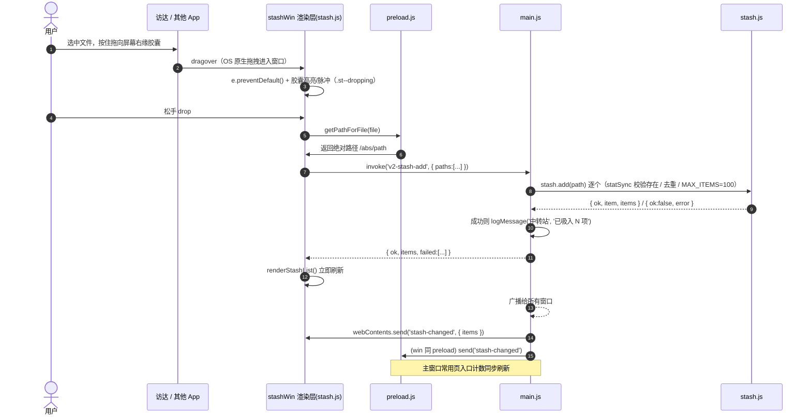
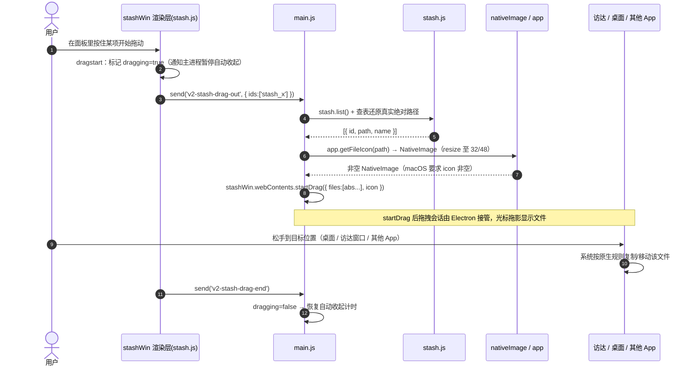
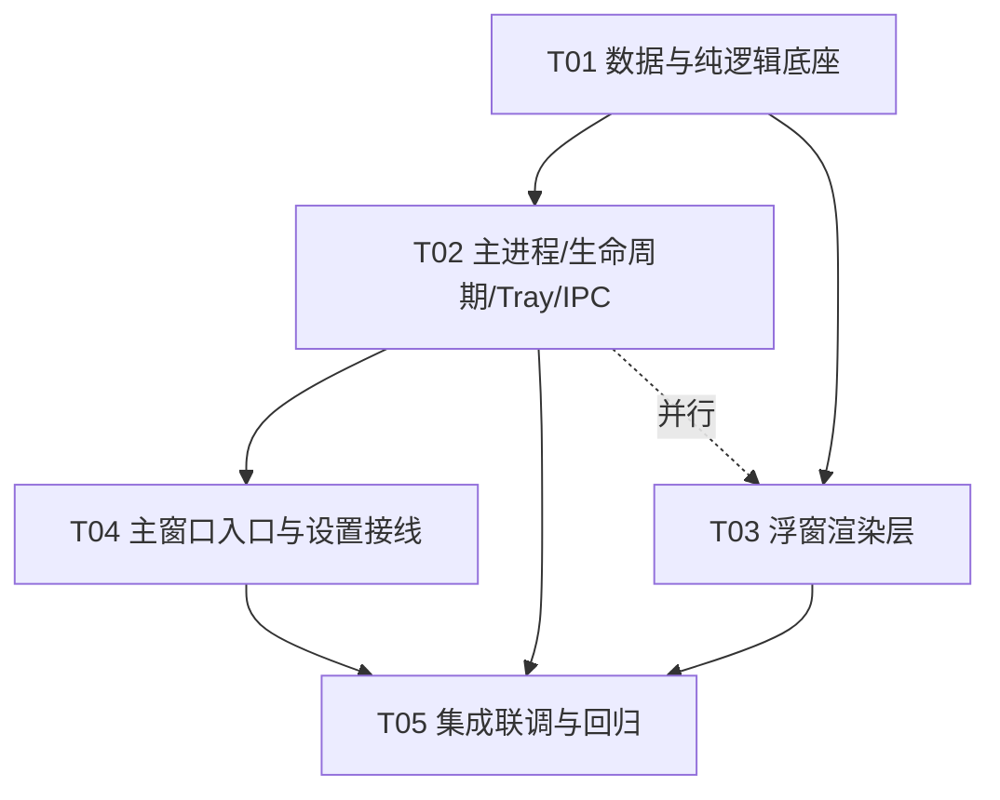

# 15 · 增量设计：中转站浮窗（屏幕边缘胶囊 ⇄ 右侧抽屉）

> 状态：**待评审** · 类型：**架构级增量变更**（不是从零新建）
> 目标项目：Mio（macOS 桌面陪伴机器人，Electron 33.4.11）
> 关联：`14-功能设计方案-中转站-磁盘总览-太阳图.md`（背景参考，其中「中转站」一节的投递入口已被本设计取代）
> 硬约束：`package.json` 的 `dependencies` 必须保持为空；全项目唯一删除通道为 `shell.trashItem`；不破坏现有功能。

---

## 0. 一句话方案总览

在现有单窗口桌宠之外，新增 **1 个可变形置顶窗口 `stashWin`**（屏幕右缘的「胶囊 ⇄ 抽屉」两种形态**共用同一个 BrowserWindow**）+ **1 个菜单栏 `Tray`**；数据层**直接复用**已完整的 `main/core/stash.js`（不重写），新增一个**零副作用纯函数模块** `main/core/stashPanel.js` 负责「边缘热区判定 + 胶囊吸附 + 展开/收起状态机」的几何与状态计算。**拖入**由渲染层用 HTML5 `dragover/drop` + `webUtils.getPathForFile` 完成；**拖出**由主进程 `webContents.startDrag` 完成（渲染层只传节点 id，主进程查表还原真实路径）。全景只有「一个桌宠窗口 + 一个中转站浮窗 + 一个菜单栏图标」，零第三方依赖。

---

## 1. 现状核实（已读码到行号）

| 项 | 结论 | 位置 |
|---|---|---|
| 主进程单文件 | ~3700 行，窗口/热键/IR 全在此 | `main.js` |
| require 清单 | **无 `Tray`**；有 `app, BrowserWindow, ipcMain, Menu, Notification, globalShortcut, screen, shell, clipboard, systemPreferences, nativeImage, dialog` | `main.js:2` |
| 桌宠窗口 | `createWindow()`；`frame:false / transparent:true / resizable:false / skipTaskbar:true / hasShadow:false / fullscreenable:false`，`webPreferences:{ preload, contextIsolation:true, nodeIntegration:false }` | `main.js:166-239` |
| 置顶层级 | `applyAppearance()` → `win.setAlwaysOnTop(!!onTop, 'floating')`；并 `setVisibleOnAllWorkspaces(true,{visibleOnFullScreen:true})` | `main.js:123, 215` |
| 点击穿透 | 默认 `win.setIgnoreMouseEvents(true,{forward:true})`，悬停在可交互元素上由渲染层发 `mouse-interactive` 关闭 | `main.js:220, 279-282` |
| 召唤键 | `applyHotkey/restoreHotkey/registerHotkeyFromSettings`，默认 `DEFAULT_HOTKEY='Alt+Space'`，保留键 `RESERVED_HOTKEY='Alt+H'`（恒定兜底不可覆盖） | `main.js:2371-2427` |
| 退出清理 | `globalShortcut.unregisterAll()` | `main.js:3293` |
| 隐藏 Dock | `app.dock?.hide()` | `main.js:3664` |
| **关窗即退** | `app.on('window-all-closed', () => app.quit())` | `main.js:3665` |
| 现有 stash IPC | `v2-stash-list/add/remove/clear` | `main.js:3396-3409` |
| stash 数据层 | **完整**：`load/persist/list/add/remove/clear/stashFile/MAX_ITEMS` | `main/core/stash.js` |
| settings | `SETTINGS_VERSION=8`；`stash:{enabled:true,persist:true,items:[]}`；`sanitizeSettings` 收口机制 | `main/core/settings.js:5,89-90,200-206` |
| preload | `window.mio` + `window.mio.v2` 命名空间 | `preload.js:111-144` |
| 常用页卡片 | `stashCard`（粘贴输入框 + 列表 + 清空），开关 `swStash` | `index.html:143-151, 600` |
| 渲染逻辑 | `renderStashCard/addStash/clearStash` + 事件委托；`applyFeatureVisibility` 控制显隐 | `app.js:691-738, 585, 2625` |
| 打包 | `pack.sh` 显式 `cp renderer/index.html style.css app.js`；`cp -R main` 覆盖 `main/core/**` | `pack.sh:30-32` |
| 图标资源 | `build/icon.icns`、`build/icon.png`、`build/icon.iconset/icon_16x16.png`(+@2x) | 已存在 |
| 测试 | `node:test`，`npm test = node --test test/*.test.js` | `test/` |
| API 可用性 | Electron 33.4.11：`webUtils.getPathForFile`✅、`webContents.startDrag(item)`✅（`Item.files?:string[]` 支持多文件）、`Tray`✅、`app.getFileIcon`✅ | `electron.d.ts` 已核对 |

> **注意（与 prompt 的差异）**：主窗口默认召唤键实际是 `Alt+Space`（`DEFAULT_HOTKEY`），`Alt+H` 是恒定兜底的保留键。二者都不可被中转站键占用。

---

## 2. 窗口架构

### 2.1 决策：胶囊与抽屉 = 同一个 BrowserWindow 的两种形态（推荐方案 A）

**选项对比**

| | 方案 A：单窗口形变（**采用**） | 方案 B：胶囊窗 + 抽屉窗 两独立窗口 |
|---|---|---|
| 形态切换 | 一次 `setBounds` 窗口缩放（项目已有先例：`panel-expand`） | 两窗口互相 hide/show，需坐标接力 |
| 渲染层 | 一个 `stash.html` + 一个 `stash.js`，DOM 在「胶囊态 / 抽屉态」间切 class | 两套 DOM、两个渲染进程、状态需同步 |
| 拖拽会话 | 拖入/拖出都在同一 webContents，无跨窗口交接 | 拖拽跨窗口交接复杂、易闪断 |
| 内存/生命周期 | 一个窗口、一个 preload、一处 `window-all-closed` 记账 | 两个窗口、两处记账 |
| `alwaysOnTop` | 单层级，够用 | 可分别设级（此处收益极小） |

**结论：采用方案 A。** 胶囊与抽屉占据同一屏幕边缘区域、且是**连续形变**（hover 展开），单窗口缩放最自然，且复用现有 `panel-expand` 的「窗口瞬时改尺寸、过渡交给 CSS」范式（`main.js:288-298`）。

### 2.2 全景结构（3 个窗口级实体）

```
┌─ win（现有桌宠窗口，不动） ────────────────┐   frame:false transparent alwaysOnTop:'floating'
│  位置：用户拖动记忆，默认右下角             │   setIgnoreMouseEvents(true,{forward:true})
└────────────────────────────────────────────┘
┌─ stashWin（新增：胶囊 ⇄ 抽屉，单窗口形变）─┐   frame:false transparent alwaysOnTop:'floating'
│  胶囊态：右缘细条（约 6×104），常驻         │   setVisibleOnAllWorkspaces(true,{visibleOnFullScreen:true})
│  抽屉态：右缘 320×{H} 抽屉                  │   交互策略见 §2.5
└────────────────────────────────────────────┘
┌─ tray（新增：菜单栏图标，非窗口）──────────┐   Menu bar 常驻，点击显示/隐藏抽屉
└────────────────────────────────────────────┘
数据层：main/core/stash.js（复用）  ·  几何/状态机：main/core/stashPanel.js（新增纯函数）
```

### 2.3 `stashWin` 完整 BrowserWindow 构造参数

```js
// 与 createWindow() 保持一致的代码风格（main.js:194-213）
stashWin = new BrowserWindow({
  width:  CAPSULE.w,          // 初始为胶囊尺寸（stashPanel.capsuleRect）
  height: CAPSULE.h,
  x, y,                       // stashPanel.capsuleRect(workArea) 计算所得，贴右缘、垂直居中
  frame: false,
  transparent: true,
  resizable: false,
  movable: false,             // 位置由吸附算法控制，不给用户手动拖（避免与桌宠手拖冲突）
  alwaysOnTop: true,          // 常驻置顶，独立于 appearance.onTop（胶囊必须可见）
  skipTaskbar: true,
  hasShadow: false,
  fullscreenable: false,
  minimizable: false,
  maximizable: false,
  backgroundColor: '#00000000',
  webPreferences: {
    preload: path.join(__dirname, 'preload.js'),   // 复用同一个 preload
    contextIsolation: true,
    nodeIntegration: false,
  },
});
stashWin.setAlwaysOnTop(true, 'floating');         // 与桌宠同层级；见 §2.5 层级说明
stashWin.setVisibleOnAllWorkspaces(true, { visibleOnFullScreen: true });
stashWin.loadFile(path.join(__dirname, 'renderer', 'stash.html'));
```

**层级选择说明**：与桌宠保持 `'floating'`（配合 `visibleOnFullScreen:true` 已能浮在全屏 App 之上，桌宠现状即验证了这一点）。若实测在个别全屏 App 上仍被遮挡，再升级为 `'screen-saver'`（更激进，会盖过菜单栏，非必要不用）。**不采用 `'screen-saver'` 作为默认**，避免遮挡系统 UI。

### 2.4 与 `app.on('window-all-closed')` 的冲突 —— 具体修复

**风险**：`main.js:3665` 现为 `app.on('window-all-closed', () => app.quit())`。新增常驻浮窗后，一旦 `stashWin` 或 `win` 被**销毁（destroyed，不是 hide）**，且此刻无其它存活窗口，就会触发 `window-all-closed` → **App 直接退出，中转站一并消失**。此外 Mio 已是「菜单栏常驻应用」，关闭窗口退出本身就与 Tray/Dock 常驻语义矛盾。

**修复（改 `main.js:3663-3665` 这两行区块）**：

```js
// v2.1 中转站：Mio 升级为「菜单栏常驻应用」（Tray + 右缘胶囊），
// 关闭任一窗口不再退出 App —— 退出统一走 Tray「退出 Mio」/ 右键菜单 / quit IPC。
let isQuitting = false;

app.on('before-quit', () => { isQuitting = true; });

app.on('window-all-closed', () => {
  // macOS 惯例 + 本应用靠 Tray 常驻：窗口全关也不退出。
  // 真正的退出路径由 isQuitting 标记的 before-quit / app.quit() 触发。
});
```

**同时（防御式）**：`stashWin` 的 `close` 事件必须被拦截为「隐藏」而非「销毁」，防止渲染进程崩溃触发销毁后连带 `window-all-closed`：

```js
stashWin.on('close', (e) => {
  if (!isQuitting) { e.preventDefault(); stashPanel.hide(); } // 只隐藏，不销毁
});
```

`win` 的现有隐藏逻辑（`toggleWindow` 用 hide/show）无需改动；`quit` IPC / 右键菜单「退出 Mio」/ Tray「退出」仍走 `app.quit()`（会先触发 `before-quit` 置位 `isQuitting`，随后窗口才真正关闭）。**这是本设计最易出事处，必须在 T02 落地并回归验证。**

### 2.5 穿透与拖放目标的矛盾（关键取舍）

桌宠窗口默认 `setIgnoreMouseEvents(true,{forward:true})`（点击穿透，靠渲染层 hover 再关闭穿透）。**中转站胶囊不能照搬这套**：文件从访达拖向胶囊时，若窗口处于 ignore 状态，OS 级拖放事件不会投递到该窗口，`dragover/drop` 收不到。

**决策**：
- **`stashWin` 默认 `setIgnoreMouseEvents(false)`（始终可交互）**，以保证「拖入」稳定可用。代价：窗口矩形内的透明像素也会捕获点击。**通过几何收敛控制影响面**：胶囊态窗口仅为贴右缘的细条（`CAPSULE = { w: 6, h: 104 }`，垂直居中），对桌面点击的遮挡可忽略。
- 抽屉态形变为 `320×{H}` 抽屉，同样保持可交互（用户就是要操作它）。
- 抽屉**收起后**若用户觉得细条碍事，可在设置里把「常驻胶囊」关掉（`stash.panelEnabled=false` → `stashWin.hide()`），仅靠热键/Tray 呼出。

> 备选（不在本期）：默认穿透 + 主进程光标轮询撞边时才 `setInteractive(true)`。因无法可靠感知「正在从 Finder 拖拽」，会牺牲拖入稳定性，**不采用**。

---

## 3. 交互时序图

### 3.1 拖文件 → 胶囊吸入 → 面板刷新



### 3.2 从面板拖出文件到访达（原生拖拽）



---

## 4. 边缘热区与吸附的纯函数设计（`main/core/stashPanel.js`）

**定位**：与 `main/core/*.js` 同风格——**纯函数、零副作用、不 require electron**（便于 `node --test` 单测）。所有屏幕坐标以「显示器 workArea 逻辑像素」为输入，不在模块内调用 `screen`。

**导出常量**

```js
const CAPSULE = { w: 6, h: 104 };     // 胶囊可见尺寸（贴右缘细条）
const PANEL   = { w: 320, h: 0 };     // 抽屉宽度固定；高度运行时按 workArea 计算
const EDGE_MARGIN = 8;                // 触边判定的外扩容差（px）
```

**函数签名（全部纯函数）**

```js
// 几何：给定显示器工作区 → 胶囊矩形（贴右缘、垂直居中）
capsuleRect(workArea, settings) -> { x, y, width, height }

// 几何：给定显示器工作区 → 抽屉矩形（贴右缘，纵向内缩边距）
panelRect(workArea, settings) -> { x, y, width, height }

// 热区：光标是否命中右缘热区（考虑 settings.edgeThreshold 灵敏度）
hitEdge(cursor, workArea, settings) -> boolean

// 热区矩形（调试/绘制用，也用于主进程命中判定）
edgeZone(workArea, settings) -> { x, y, width, height }

// 状态机 reducer：输入上一状态 + 事件 + 上下文 → 下一状态 + 目标矩形 + 是否可交互
resolvePanelState(prev, event, ctx) -> {
  mode,          // 'hidden' | 'capsule' | 'open'
  pinned,        // 是否被用户钉住（钉住则不自动收起）
  dragging,      // 是否有进行中的拖拽（拖拽期间禁止自动收起）
  rect,          // { x, y, width, height } —— 目标窗口矩形
  interactive,   // boolean —— 是否 setIgnoreMouseEvents(false)
}

// 是否应自动收起（纯判定，供主进程 300ms tick 调用）
shouldAutoCollapse(prev, cursor, now, settings) -> boolean

// 越界兜底：把矩形夹回 workArea 内（多屏/拔屏后防丢）
clampRect(rect, workArea) -> rect
```

**`resolvePanelState` 事件与转移表**

| 当前 mode | 事件 | 条件 | 下一 mode | 备注 |
|---|---|---|---|---|
| hidden | `TOGGLE` / `SHOW` | — | open | 热键 / Tray 点击 |
| hidden | `HOVER_IN` | `edgeHot` | capsule→open | 撞边自动展开 |
| capsule | `HOVER_IN`(抽屉) / `DRAG_ENTER` | — | open | 鼠标移入胶囊/抽屉 |
| capsule | `DRAG_ENTER` | — | open + `dragging=true` | 拖拽悬停即展开 |
| open | `DRAG_ENTER`/`LEAVE` | — | open，`dragging` 切换 | 拖拽期间锁展开 |
| open | `HOVER_OUT` | `!pinned && !dragging` 且超过 `autoHideDelay` | capsule | 自动收起 |
| open | `PIN_TOGGLE` | — | pinned 取反 | 钉住=永不自动收起 |
| capsule | `PIN_TOGGLE` | — | open + pinned | 一步钉住并展开 |
| any | `HIDE` | — | hidden | 设置里关闭常驻 |
| any | `TICK` | `shouldAutoCollapse` 真 | capsule | 300ms 心跳兜底 |

`ctx` = `{ workArea, settings, cursor, now, lastActivity }`。`resolvePanelState` 与 `shouldAutoCollapse` 均不改入参、不读全局，同一输入必得同一输出 → **可完整单测**（T01 的 `test/stashPanel.test.js`）。

**主进程侧的薄封装（非纯，放 `main.js`）**：`applyPanelState(next)` 只做 IO——`stashWin.setBounds(next.rect)`、`stashWin.setIgnoreMouseEvents(!next.interactive,{forward:true})`、`stashWin.webContents.send('stash-panel-mode',{mode,pinned})`、以及隐藏时的 `stashWin.hide()`。

---

## 5. 拖放的实现方案

### 5.1 拖入（HTML5）

- **事件**：`stashWin` 渲染层监听 `dragover`（`e.preventDefault()` 才能触发 `drop`）、`drop`、`dragenter/dragleave`（做高亮态）。
- **取路径（正确方式）**：Electron 中 `File.path` 已废弃，使用 **`webUtils.getPathForFile(file)`**。经核对，**Electron 33.4.11 已支持**（`electron.d.ts:17709`）。
- **preload 暴露（contextIsolation:true 下必须经 preload）**：

  ```js
  const { contextBridge, ipcRenderer, webUtils } = require('electron');
  // 官方推荐的迁移写法：把 getPathForFile 直接挂到 window，File 对象可跨 contextBridge 传递
  contextBridge.exposeInMainWorld('getPathForFile', (f) => webUtils.getPathForFile(f));
  ```

- **降级方案**：若运行在 <30 的旧 Electron（本项目不会，但保证健壮），`webUtils` 取不到时回退 `file.path || ''`；两者皆空则忽略该项并提示「无法读取该文件路径」。
- **主进程再校验**：`v2-stash-add` 收到 path 后仍由 `stash.add()` 执行 `path.resolve + fs.statSync` 校验存在性 / 去重 / 上限（`stash.js:50-74` 已实现），不信任渲染层。
- **安全边界说明**：drop-in 的 path 来自**用户真实的 OS 拖拽**，不可被渲染层伪造为任意路径；且仅写入「路径引用」，无副作用。**id-only 规则**（见 §7）针对的是对**已存条目**的操作（拖出/显示/打开）——那些才需要「渲染层只传 id、主进程查表还原」。

### 5.2 拖出（必须主进程发起）

- **API**：`stashWin.webContents.startDrag(item)`，`item = { files: string[], icon: NativeImage }`。`Item.files` 覆盖 `file` 字段，**支持多文件**（`electron.d.ts:19804-19817` 已核对）。
- **调用位置**：**主进程**。渲染层 `dragstart` → `send('v2-stash-drag-out', { ids })`；主进程查表还原路径后调用 `startDrag`。
- **图标生成**：`await app.getFileIcon(absPath, { size: 'normal' })` 得到 `NativeImage`；多选时用首项的图标，或 `nativeImage` 拼一个「×N」角标（v1 用首项图标即可，标注为可选优化）。**macOS 要求 icon 非空**，若 `getFileIcon` 失败则回退 `nativeImage.createFromPath('build/icon.iconset/icon_32x32.png')`。
- **多文件的降级**：`Item.files` 已支持数组；若某版本 `startDrag` 对多文件表现异常，降级为「仅拖出选中的第一项」并提示（保证单文件链路一定通）。
- **时序细节**：`startDrag` 会阻塞直到拖拽结束；调用前须把 `dragging=true` 推给状态机，拖拽结束后 `v2-stash-drag-end` 复位，避免抽屉在拖拽途中自动收起。

---

## 6. Tray 设计

- **图标来源**：项目已有 `build/icon.iconset/icon_16x16.png`(+`@2x`)、`build/icon.icns`、`build/icon.png`。
  - 首选：用 `nativeImage.createFromPath('build/icon.iconset/icon_16x16.png')` 并 `setTemplateImage(true)` 做**模板图**（自动适配深浅色菜单栏）。若该彩色图标做模板图观感不佳，**备选**：新增一个 22×22 的单色 PNG（`build/trayTemplate.png` + `@2x`），由 `build/make-icon.js` 生成（零依赖，Node 脚本）。
  - `Tray` 构造时必须持有引用（全局 `let tray = null`），否则被 GC 后图标消失——这是 Electron 常见坑，务必写进共享知识。
- **菜单项**：
  ```
  显示 / 隐藏中转站    ← 点击等价 stashPanel.toggle()
  ───────────
  打开设置             ← 显示主窗口并切到设置页（复用 toggleWindow + 一次 IPC）
  清空中转站（N 项）    ← 二次确认后 stash.clear()（只删引用）
  ───────────
  退出 Mio            ← app.quit()
  ```
- **点击行为**：macOS 上 Tray 建议**只弹菜单**（`tray.setContextMenu(menu)`），不绑 `click` 直接 toggle，避免与菜单冲突；「显示/隐藏」作为菜单第一项。若希望「单击图标即切换」，可 `tray.on('click', toggleStashPanel)` 并保留右键菜单（macOS 单击默认弹菜单，需 `setContextMenu` + 额外处理，v1 采用「点击弹菜单」最稳）。
- **与 `app.dock.hide()` 共存**：`app.dock?.hide()` 只隐藏 **Dock 图标**，不影响 `Tray`（菜单栏）。二者互不冲突；Tray 恰好补上 Dock 隐藏后缺失的常驻入口。**这正是本需求的价值点** —— 用户曾找不到功能，现在有菜单栏图标兜底。
- **开关**：`stash.trayEnabled=false` 时 `tray.destroy(); tray=null`。

---

## 7. IPC 契约表（新增全部列出）

**命名风格沿用 `v2-xxx`**；全部在 `preload.js` 的 `window.mio.v2` 命名空间下暴露。

| 通道 | 方向 | 入参 | 出参 | 副作用 |
|---|---|---|---|---|
| `v2-stash-add`（**已存在，扩展**） | invoke | `{ path }` 或 `{ paths:[...] }` | `{ ok, items, added, failed? }` | 写 `mio-stash.json`；`logMessage`；广播 `stash-changed` |
| `v2-stash-list`（已存在） | invoke | — | `{ ok, items }` | 每次 `statSync` 刷新 `exists/size` |
| `v2-stash-remove`（已存在） | invoke | `{ id }` | `{ ok, items }` | 只删引用；广播 `stash-changed` |
| `v2-stash-clear`（已存在） | invoke | — | `{ ok, items:[] }` | 只删引用；广播 |
| `v2-stash-drag-out` | **send** | `{ ids:[string] }` | — | 主进程查表还原路径 → `startDrag`（**渲染层看不到路径**） |
| `v2-stash-drag-end` | send | — | — | 复位状态机 `dragging=false` |
| `v2-stash-reveal` | invoke | `{ id }` | `{ ok, error? }` | `shell.showItemInFolder(还原路径)` |
| `v2-stash-open` | invoke | `{ id }` | `{ ok, error? }` | `shell.openPath(还原路径)` |
| `v2-stash-copy-path` | invoke | `{ id }` | `{ ok }` | `clipboard.writeText(还原路径)` |
| `v2-stash-pick` | invoke | — | `{ ok, items, canceled? }` | `dialog.showOpenDialog({properties:['openFile','openDirectory','multiSelections']})` → 逐个 `stash.add` |
| `v2-stash-panel-state` | invoke | — | `{ ok, mode, pinned, side }` | 无（渲染层初始化用） |
| `v2-stash-panel-toggle` | send | — | — | 切换 抽屉/胶囊 |
| `v2-stash-panel-show` | send | — | — | 强制展开（Tray/热键路径） |
| `v2-stash-panel-hide` | send | — | — | 收起 |
| `v2-stash-panel-pin` | invoke | `{ pinned }` | `{ ok, pinned }` | 写 `settings.stash.pinned` |
| `v2-stash-panel-hover` | send | `{ over:boolean }` | — | 供状态机计时（可选，主进程也可自行轮询） |

**主进程 → 渲染（事件）**

| 事件 | 载荷 | 用途 |
|---|---|---|
| `stash-changed` | `{ items }` | 任一来源（drop/pick/remove/清空）后**广播给所有窗口**，两侧列表/计数同步 |
| `stash-panel-mode` | `{ mode, pinned }` | 通知 `stashWin` 切胶囊/抽屉 CSS 态 |

**安全要求（硬性）**：`v2-stash-drag-out / reveal / open / copy-path / panel-*` 等**涉及文件路径**的通道，**渲染层只传节点 `id`**，主进程用 `stash.list()`/内部表**查表还原真实路径**，杜绝路径注入。仅 `v2-stash-add`（drop-in）例外，理由见 §5.1。

---

## 8. 数据模型变更（`settings.stash`）

`main/core/settings.js` 的 `DEFAULT_SETTINGS.stash` 扩展为：

```js
stash: {
  // ===== 既有（不动）=====
  enabled: true,
  persist: true,
  items: [],
  // ===== v2.1 浮窗新增 =====
  panelEnabled: true,      // 右缘胶囊是否常驻显示（false → 仅热键/Tray 呼出）
  edgeHot: true,           // 鼠标撞屏边自动展开
  edgeSide: 'right',       // 'right' | 'left'（v1 仅实现 right，字段先留位）
  edgeThreshold: 6,        // px，撞边灵敏度（1–24）
  autoHideDelay: 1200,     // ms，离开后自动收起延迟（300–6000）
  pinned: false,           // 抽屉是否钉住
  hotkey: 'Alt+Shift+Space', // 独立全局键；null=未注册
  trayEnabled: true,       // 菜单栏图标
  capsuleOpacity: 0.6,     // 胶囊半透明度（0.3–1）
}
```

**`sanitizeSettings` 收口规则（追加在现有 F10 stash 段之后，`settings.js:200-206`）**：

```js
// 布尔收口
s.stash.panelEnabled = !!s.stash.panelEnabled;
s.stash.edgeHot      = !!s.stash.edgeHot;
s.stash.pinned       = !!s.stash.pinned;
s.stash.trayEnabled  = !!s.stash.trayEnabled;
// 枚举收口
s.stash.edgeSide = ['right','left'].includes(s.stash.edgeSide) ? s.stash.edgeSide : 'right';
// 数值收口（沿用 clamp）
s.stash.edgeThreshold  = clamp(Math.round(Number(s.stash.edgeThreshold) || 6), 1, 24);
s.stash.autoHideDelay  = clamp(Math.round(Number(s.stash.autoHideDelay) || 1200), 300, 6000);
// 不透明度走唯一口径 normUnit（与 appearance/stealth 一致）
s.stash.capsuleOpacity = normUnit(s.stash.capsuleOpacity, 0.3, 1, 0.6);
// 快捷键：字符串或 null（沿用 F8 split.hotkey 的收口写法，settings.js:194）
s.stash.hotkey = (typeof s.stash.hotkey === 'string' && s.stash.hotkey.trim()) ? s.stash.hotkey.trim() : null;
```

> 老配置文件零改动可用（`deepMerge` 自动补齐新键，见 `settings.js:109-120`）。`SETTINGS_VERSION` 建议同步 +1（8 → 9），仅作标记，不做逐版 migration。

---

## 9. 文件列表

**新增**

| 相对路径 | 职责（一句话） |
|---|---|
| `main/core/stashPanel.js` | 边缘热区/胶囊吸附/展开状态机的**纯函数模块**（零副作用、可单测） |
| `renderer/stash.html` | 中转站浮窗页面：胶囊态 + 抽屉态两套 DOM（同页切 class） |
| `renderer/stash.js` | 浮窗渲染逻辑：列表渲染、拖入(drop/webUtils)、拖出(dragstart)、项菜单、pin |
| `renderer/stash.css` | 浮窗样式（引用 `--mi-*` 变量，胶囊/抽屉/拖拽高亮/玻璃质感） |
| `renderer/theme.css` | 抽出的 `--mi-*` 主题变量，供 `index.html` 与 `stash.html` 共用（消除重复） |
| `test/stashPanel.test.js` | `stashPanel.js` 纯函数单测（几何/命中/状态机） |
| `docs/15-增量设计-中转站浮窗.md` | 本文档 |

**修改**

| 相对路径 | 改动要点（改到哪个函数/行区块） |
|---|---|
| `main.js` | ①`require` 增 `Tray`（`main.js:2`）；②新增 `createStashWindow()` 与全局 `stashWin/tray/isQuitting`；③新增 `applyStashHotkey/registerStashHotkeyFromSettings`（仿 `main.js:2384-2424`，含冲突检测）；④新增 §7 IPC；⑤`window-all-closed` 区块改写（§2.4）；⑥`screen` 显示器变化监听重算吸附；⑦`stashWin.on('close')` 拦截；⑧`will-quit` 清理新 timer/销毁 tray |
| `preload.js` | 新增 `webUtils` + `getPathForFile`；`window.mio.v2` 下新增 §7 全部通道 + `onStashChanged/onStashPanelMode` |
| `main/core/settings.js` | `DEFAULT_SETTINGS.stash` 扩展（§8）+ `sanitizeSettings` 收口；`SETTINGS_VERSION` 8→9 |
| `renderer/index.html` | 简化 `stashCard`（`index.html:143-151`）为入口卡；设置页新增浮窗相关开关 + 快捷键录制行（`index.html:600` 附近） |
| `renderer/app.js` | `renderStashCard`（`app.js:691-704`）改为「N 项 · 打开面板」入口；新增新设置项 `bindSwitch` 与快捷键录制；订阅 `onStashChanged` |
| `renderer/style.css` | 入口卡样式；`:root` 变量迁移到 `theme.css` 后相应调整 |
| `pack.sh` | 打包清单新增 `renderer/stash.html renderer/stash.js renderer/stash.css renderer/theme.css`（`pack.sh:32`）——**漏改会导致打包后浮窗白屏** |

---

## 10. 任务列表（按依赖排序；≤5 个）

> 分组原则：按功能层次切片，不做「一文件一任务」；T01 承担「基础设施/数据底座」角色。

### T01 · 数据与纯逻辑底座 `[P0｜无依赖｜可立即开工]`
- **文件**：`main/core/settings.js`（§8 扩展+收口）、`main/core/stashPanel.js`（新建）、`test/stashPanel.test.js`（新建）、`pack.sh`（打包清单）
- **要点**：纯函数签名与状态机先冻结（§4）；`npm test` 必须全绿。
- **交付物**：可单测的几何/状态机；settings 新键可读写并收口。

### T02 · 主进程窗口 / 生命周期 / Tray / IPC `[P0｜依赖 T01]`
- **文件**：`main.js`、`preload.js`、`renderer/theme.css`
- **要点**：`createStashWindow()`；**`window-all-closed` 修复 + `close` 拦截 + `isQuitting`**（§2.4）；Tray（§6）；`applyStashHotkey`（冲突检测：禁用 `Alt+Space`/`Alt+H`）；§7 全部 IPC（含 `startDrag`）、`stash-changed`/`stash-panel-mode` 广播；`screen` 监听重算吸附。
- **可并行**：T02 与 T03 并行（契约已由 T01 冻结）。

### T03 · 浮窗渲染层（胶囊 ⇄ 抽屉 + 拖入/拖出） `[P0｜依赖 T01（契约）；可与 T02 并行]`
- **文件**：`renderer/stash.html`、`renderer/stash.js`、`renderer/stash.css`
- **要点**：两态 DOM 切 class；`dragover/drop` + `getPathForFile` 吸入；`dragstart`→`v2-stash-drag-out`；项菜单（显示/打开/复制路径/移除）；pin 按钮；空态引导。
- **交付物**：UI 走通；接上 T02 的 IPC 后即全链路可用。

### T04 · 主窗口入口与设置页接线 `[P1｜依赖 T02]`
- **文件**：`renderer/index.html`、`renderer/app.js`、`renderer/style.css`
- **要点**：`stashCard` 简化为入口（§12 建议方案）；新增设置项开关与快捷键录制；订阅 `onStashChanged` 同步计数；`applyFeatureVisibility` 同步胶囊显隐。

### T05 · 集成联调与回归 `[P0｜依赖 T02,T03,T04]`
- **文件**：`main.js`（时序/边界微调）、`renderer/stash.js`（边界修复）、`test/stashPanel.test.js`（补充回归）、`docs/15-*.md`（更新落地状态）
- **要点**：回归「拖入→看见→拖出」全链路；验证「关主窗口 App 不退出」；多显示器/拔屏；置顶/全屏；打包（`pack.sh`）后浮窗资源齐全。

**依赖图**



---

## 11. 共享知识（跨文件约定，工程师务必遵守）

- **全局变量名（main.js）**：`stashWin`（浮窗）、`tray`（菜单栏，**必须持有引用防 GC**）、`isQuitting`（退出标志）、`stashPanelTimer`（300ms 状态机心跳）。
- **DOM id 前缀**：浮窗一律 `st-`（如 `stRoot` / `stList` / `stItem` / `stDropHint` / `stPinBtn`）；主窗口沿用现有命名（`stashCard` / `stashList` / `swStash` 不动）。
- **CSS 类前缀**：浮窗 `st-`；胶囊态 `.st--capsule`、抽屉态 `.st--open`、放置高亮 `.st--dropping`、钉住 `.st--pinned`。
- **CSS 变量**：统一引用 `--mi-*`（`--mi-surface-rgb / --mi-accent / --mi-on-accent / --mi-warn / --mi-danger`），来源 `renderer/theme.css`，禁止在 `stash.css` 里另造色值。
- **IPC 命名**：`v2-stash-*`（数据/操作）、`v2-stash-panel-*`（浮窗控制）；事件 `stash-changed` / `stash-panel-mode`。
- **ID-only 安全规则**：对已存条目的路径操作，渲染层恒传 `id`，主进程查表还原；**唯 `v2-stash-add` 例外**（drop/pick 的真路径）。
- **删除规则**：全项目唯一删除通道 `shell.trashItem`；stash 的「移除/清空」只删引用，**永不触碰源文件**。
- **窗口层级**：浮窗与桌宠统一 `alwaysOnTop(true,'floating')` + `setVisibleOnAllWorkspaces(true,{visibleOnFullScreen:true})`。
- **窗口生命周期**：任一窗口 `close` 若非 `isQuitting` 一律 `preventDefault + hide`，**绝不 destroy**。
- **打包清单**：新增 `renderer/*` 文件必须同步进 `pack.sh:32`（`main/` 目录由 `cp -R main` 自动覆盖）。
- **settings 收口**：所有新数值/枚举/布尔都必须进 `sanitizeSettings`，保证「就算某入口忘了换算，落盘的永远合法」（`settings.js` 既有约定）。

---

## 12. 待明确事项（需团队/用户拍板）

1. **常用页原有 `stashCard` 的去留** —— 我的建议是**保留但简化**：改为一行入口卡「中转站 · N 项　　　[打开面板]」，并在下方保留「粘贴路径加入」的输入框（保留既有无障碍/精确投递能力，成本极低），**移除内联列表**（列表统一住浮窗面板，避免两处重复渲染与状态同步）。理由：主窗口是用户的「功能地图」，直接移除会让老用户找不到；但内联列表与浮窗重复，应删。
   - 待确认：是否接受「保留路径粘贴输入框」？还是彻底只留入口按钮？
2. **胶囊默认常驻位置** —— 建议**右缘垂直居中**（避开桌宠默认的右下角）。若桌宠被用户拖到右缘中部可能视觉重叠，是否需要「胶囊自动避让桌宠矩形」的增强逻辑（v2）？
3. **多显示器策略** —— 建议 v1 只在一屏（光标所在屏/appearance.displayId 指定屏）显示胶囊；是否需要在每块屏各放一个胶囊（v2）？
4. **热键默认值** —— 建议默认 `Alt+Shift+Space`（与主窗口 `Alt+Space`、保留键 `Alt+H` 均不冲突）。是否接受此默认；还是要求「默认不注册、由用户自行录制」？
5. **拖出多文件的图标** —— v1 用首项图标；是否需要「×N 角标」视觉效果（可选优化）？
6. **抽屉宽度** —— 建议 320px（与 `panel-expand` 的 360 面板档接近，视觉统一）。是否需要固定 360px？
7. **Tray 单击行为** —— 建议「单击弹菜单」（最稳）；若坚持「单击即切换面板 + 右键菜单」，需额外处理 macOS 菜单栏交互，确认是否值得。
8. **`SETTINGS_VERSION` 是否升 9** —— 建议升（仅作标记，无 migration）；如团队希望保持 8 以免影响既有测试断言（`test/core.test.js:22-25` 硬编码 8），则维持 8 并在文档注明。

---

## 附：类图（数据/服务结构）

```mermaid
classDiagram
  class StashStore {
    <<module main/core/stash.js (复用)>>
    +MAX_ITEMS: int = 100
    +load() Array
    +persist(items) bool
    +list() Array~StashItem~
    +add(p) {ok, item?, items?, error?}
    +remove(id) {ok, items?}
    +clear() {ok, items}
    +stashFile() string
  }
  class StashItem {
    +string id
    +string path
    +string name
    +int size
    +bool isDir
    +int addedAt
    +bool exists  // list() 实时 statSync 刷新
  }
  class StashPanel {
    <<module main/core/stashPanel.js (新增·纯函数)>>
    +CAPSULE: {w,h}
    +PANEL: {w}
    +capsuleRect(workArea, settings) Rect
    +panelRect(workArea, settings) Rect
    +hitEdge(cursor, workArea, settings) bool
    +edgeZone(workArea, settings) Rect
    +resolvePanelState(prev, event, ctx) PanelState
    +shouldAutoCollapse(prev, cursor, now, settings) bool
    +clampRect(rect, workArea) Rect
  }
  class PanelState {
    +string mode  // hidden|capsule|open
    +bool pinned
    +bool dragging
    +Rect rect
    +bool interactive
  }
  class StashWindowController {
    <<main.js 新增>>
    -BrowserWindow stashWin
    +createStashWindow() void
    +applyPanelState(state) void
    +toggleStashPanel() void
    +hideStashPanel() void
    +startDragOut(ids) void
  }
  class TrayController {
    <<main.js 新增>>
    -Tray tray
    +createTray() void
    +refreshMenu() void
  }
  class Settings {
    <<module main/core/settings.js>>
    +DEFAULT_SETTINGS
    +deepMerge(base, patch)
    +sanitizeSettings(s)
    +clamp(v, lo, hi)
    +normUnit(v, lo, hi, fb)
  }
  class HotkeyManager {
    <<main.js 既有 hotkey 体系>>
    +applyHotkey(acc)   // 主窗口
    +registerHotkeyFromSettings() void
    +applyStashHotkey(acc) void        // 新增
    +registerStashHotkeyFromSettings() void
  }

  StashWindowController --> StashPanel : 使用纯函数算矩形/状态
  StashWindowController --> PanelState
  StashWindowController --> StashStore : 查表还原路径/增删
  StashWindowController --> HotkeyManager : toggleStashPanel 回调
  TrayController --> StashWindowController : 显示/隐藏
  StashStore --> StashItem
  Settings ..> StashPanel : 读 stash.* 配置
  Settings ..> StashWindowController : 读/写 stash.*
```

---

## 附：风险登记（Top 2）

1. **窗口生命周期 / `window-all-closed`**：常驻浮窗 + Tray 后，「任一窗口被 destroy → 触发 `window-all-closed` → App 退出」会连带杀掉中转站。必须严格执行 §2.4：`isQuitting` 标记 + `stashWin.on('close')` 拦截为 hide。**这是全设计最易出事处。**
2. **原生拖拽（拖入的穿透矛盾 + 拖出的主进程约束）**：浮窗若沿用桌宠的 `setIgnoreMouseEvents(true,{forward:true})` 会导致 OS 拖放事件投递不到 → 拖入失效；故浮窗必须默认可交互，并以「细条胶囊 + 几何收敛」控制遮挡。拖出必须由主进程 `startDrag` 发起、icon 必须非空、路径必须查表还原。二者任一处理不当，都会让「拖进去/拖出来」的核心体验断裂。
